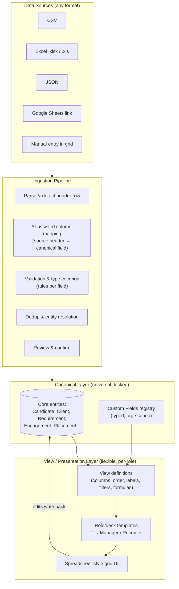
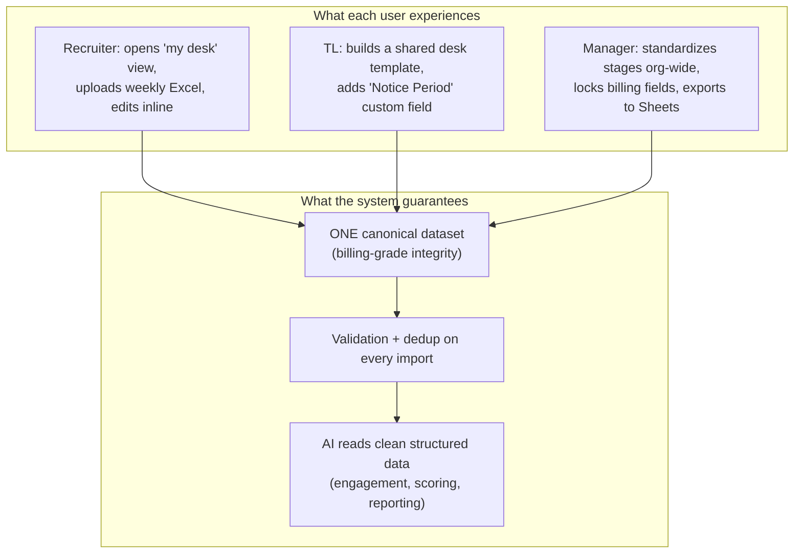

# Recruitment OS — Universal-Yet-Flexible Data Format & In-Product Spreadsheet UI

**Companion to:** `RECRUITMENT_OS_ROADMAP.md`
**Author role:** Senior FDE / AI Engineer
**Status:** Design proposal for review

---

## 1. The Problem, Stated Precisely

Every recruiter, Team Lead (TL), and Recruiting Manager already works in Excel — but each one invented their **own column layout, naming, status vocabulary, and formulas**. The agency needs:

1. **A universal data model** so the company has ONE source of truth (reporting, billing, AI all work off it).
2. **Flexibility** so a TL / Manager can adapt the layout to how their desk actually works — without a developer.
3. **Upload from anywhere** — CSV, Excel (`.xlsx`/`.xls`), JSON, and Google Sheets — no matter how messy the incoming columns are.
4. **A Google-Sheets-like UI inside the product** so nobody feels they "lost" their spreadsheet.

The tension is: **universal ⇄ flexible.** These pull in opposite directions. If you force one rigid schema, TLs revolt and go back to Excel. If you let everyone do whatever they want, you're back to the chaos you started with and can't report or bill on the data.

**The resolving idea:** separate the *canonical data layer* (locked, universal, machine-owned) from the *presentation & authoring layer* (flexible, per-role, human-owned). This is exactly the split every mature ATS and every no-code DB (Airtable) uses under the hood.

---

## 2. Market Research — How Existing Products Solve This

I looked at three categories that each solve *part* of this problem. None solves all of it for a recruitment agency out of the box, which is the gap the product fills.

### 2.1 Recruitment ATS/CRM platforms (the incumbents)

| Product | How it handles the "everyone's format is different" problem | Gap for our use case |
|---|---|---|
| **Bullhorn** | Enterprise ATS+CRM for agencies; heavy custom fields, field mapping on import, per-desk views. The "established heavyweight" for high-volume placements. | Expensive, implementation-heavy; customization is admin/consultant work, not self-serve for a TL. |
| **Recruit CRM / Recruiterflow** | Combined ATS+CRM aimed at small–midsize / exec search; custom fields, Kanban + list views, spreadsheet-like bulk edit, CSV import with column mapping. | Views are configurable but not a true spreadsheet grid with formulas; format still ultimately vendor-defined. |
| **Zoho Recruit (Staffing Edition)** | Affordable, has a genuine free tier; custom modules & fields, layout rules per profile/role. | Customization lives in admin settings, not in a familiar spreadsheet the recruiter edits live. |
| **Loxo / JobAdder / Manatal** | Modern ATS; AI sourcing, custom fields, flexible pipelines. | Same pattern: flexible *within the vendor's object model*, not a "bring your own spreadsheet" experience. |

**Takeaway:** Every serious agency ATS already separates a **fixed core object model** (Candidate, Client, Job, Placement) from **custom fields + configurable views**. That validates the canonical-vs-view split below. What they *don't* nail is a genuinely spreadsheet-native editing surface that TLs feel is "theirs."
*(Sources: [Leonar ATS roundup 2026](https://www.leonar.app/blog/applicant-tracking-systems-staffing-agency/), [JazzHR staffing software 2026](https://www.jazzhr.com/insights/best-staffing-agency-software), [Bullhorn buyer's guide](https://www.bullhorn.com/uk/blog/ai-recruitment-agency-software-buyers-guide/). Content rephrased for compliance with licensing restrictions.)*

### 2.2 Flexible databases / no-code (the "shape it yourself" approach)

- **Airtable** is the clearest reference model: it's *"a highly flexible database that can be shaped into a CRM, rather than a CRM built with predefined rules"* — tables, relationships, formulas, and **multiple views (grid / kanban / form) over the same underlying records.** That "many views over one dataset" is precisely the pattern we want.
- **Documented weaknesses** we must design around: weak native **deduplication and data-quality enforcement**, easy to create **inconsistent schemas**, per-seat pricing, and it gets **brittle at tens/hundreds of thousands of records** or heavily relational data.
*(Sources: [Larksuite Airtable-as-CRM analysis](https://www.larksuite.com/en_us/blog/airtable-crm), [Quora pros/cons thread](https://www.quora.com/What-are-the-pros-and-cons-of-using-airtable-as-a-CRM). Content rephrased for compliance with licensing restrictions.)*

**Takeaway:** Adopt Airtable's *"one canonical dataset, many role-specific views"* model, but add the **data-quality / dedup / validation guarantees** Airtable lacks — which is exactly what an agency needs for clean billing and AI.

### 2.3 Embedded data-import tooling (the "accept any file" problem)

The multi-format upload problem is a solved, commoditized space:

- **Commercial embedded importers:** **Flatfile, OneSchema, Dromo, CSVbox** — all provide a guided *Upload → pick header row → map columns → validate/clean → import* flow. OneSchema explicitly structures it as **4 steps: Upload, Header Row Selection, Mapping, Review**, and now uses an agent to **auto-infer column mappings and cleanup transforms**, only asking the human for rows it can't confidently handle.
- **Open-source parsers** if we build it ourselves: **Papa Parse** (CSV in-browser), **SheetJS** (`xlsx`), `csv-parse`, `fast-csv`.
*(Sources: [Dromo best CSV importers 2026](https://dromo.io/blog/best-csv-importers-saas-2026), [OneSchema docs](https://docs.oneschema.co/docs/intro), [CSVbox column mapping](https://blog.csvbox.io/inside-csvbox-column-mapping/). Content rephrased for compliance with licensing restrictions.)*

**Takeaway:** Don't hand-roll brittle CSV parsing. Use the well-established **Upload → Map → Validate → Review** pattern, add AI-assisted auto-mapping, and either embed a vendor (fastest) or build on Papa Parse + SheetJS (owns the stack, no per-import cost).

---

## 3. Solution Architecture — Two Layers

> **Core principle:** The machine owns the **canonical layer** (universal, stable, what billing/AI/reporting read). Humans own the **view layer** (flexible, per-role, what recruiters see and edit). A **mapping contract** connects them.



### 3.1 Canonical Layer — the universal format

A small set of **stable core entities** (already defined in the roadmap ERD: `CANDIDATE`, `CLIENT`, `REQUIREMENT`, `ASSIGNMENT`, `ENGAGEMENT`, `PLACEMENT`, `INVOICE`, `CONTRACT_TERMS`). Each has:

- **System fields** — never renamed/removed (IDs, timestamps, lifecycle status enums, owner). These power billing, AI, and cross-agency reporting.
- **A Custom Fields registry** — org-scoped, *typed* extension fields so a desk can add "Visa Status", "Notice Period (days)", "Rate Card Tier" without a schema migration.

**How to store custom fields (recommendation):** hybrid model.
- Postgres core tables for system fields (fast, relational, constraints, billing-grade integrity).
- A typed `custom_field` definition table + values stored in a **`JSONB` column** on each entity (`custom_data`), with **generated/virtual columns or GIN indexes** on the hot ones. This gives Airtable-like flexibility *without* losing SQL integrity or query speed — and avoids the "brittle at scale / inconsistent schema" trap Airtable hits.

```
CANDIDATE
├─ system:  id, full_name, email, phone, stage (enum), owner_id, created_at ...
└─ custom_data (JSONB): { "visa_status": "H1B", "notice_period_days": 30, ... }

CUSTOM_FIELD (org-scoped registry)
├─ key            e.g. "notice_period_days"
├─ label          e.g. "Notice Period (days)"
├─ entity         e.g. "CANDIDATE"
├─ type           text | number | date | enum | boolean | currency | reference
├─ enum_options   ["Immediate","15","30","60","90"]
├─ validation     required?, regex, min/max, unique?
└─ scope          org | team | desk
```

### 3.2 View Layer — the flexibility TLs want

A **View** is a saved configuration *over* the canonical data — never a copy of it. This is the Airtable "many views, one dataset" idea.

```
VIEW
├─ id, name            e.g. "Priya's IT Contract Desk"
├─ entity              CANDIDATE / REQUIREMENT ...
├─ owner / shared_with role or user scope
├─ columns[]           { field_key, display_label, width, order, frozen }
├─ filters[]           e.g. stage IN (Submitted, Interview) AND desk = "IT-Contract"
├─ sort[]              e.g. by created_at desc
├─ formulas[]          derived columns (e.g. days_in_stage = today - stage_entered_at)
├─ conditional_format  e.g. red if days_in_stage > 7
└─ layout_type         grid | kanban | form
```

**Governance model — this is the key to keeping "universal" intact:**

| Role | Can do | Cannot do |
|---|---|---|
| **Recruiter** | Create personal views, reorder/hide/rename columns *in their view*, add personal filters/sorts | Change canonical field types; delete org custom fields; edit others' billing data |
| **Team Lead** | All of the above + create **shared desk templates**, add team-scoped custom fields, set required fields for their desk | Change org-wide system fields or enums |
| **Recruiting Manager** | Define **org-wide templates & custom fields**, standardize status vocabularies, lock fields for compliance/billing | (governed by admin/audit) |

So a recruiter renaming "Candidate Name" to "Consultant" only changes *their view's display label* — the canonical field `full_name` is untouched, so billing and AI never break. **Everyone gets their format; the company keeps one dataset.**

---

## 4. Multi-Format Ingestion Pipeline

Adopt the proven **Upload → Map → Validate → Review → Commit** flow (the same 4-step shape OneSchema/Flatfile use), with AI assist.


**Design decisions:**

1. **Parsing (build vs buy).**
   - *Build (recommended for control & no per-import cost):* **SheetJS (`xlsx`)** for Excel, **Papa Parse** for CSV, native `JSON.parse` for JSON. All run client-side so big files don't hit the server first.
   - *Buy (fastest to market):* embed **Flatfile / OneSchema / Dromo / CSVbox** — you get mapping+validation UI in days, at a per-seat/per-import cost. Good for an MVP; revisit once volume makes the fee material.

2. **AI-assisted column mapping.** On upload, an LLM/heuristic matcher proposes `source header → canonical field` (e.g. "Cand Name", "Applicant", "Name" → `full_name`). **Save the confirmed mapping per user/source** so the *second* upload of "Priya's weekly sheet" is one click. This directly mirrors the agent-based auto-mapping OneSchema now ships.

3. **Validation & coercion.** Enforce the canonical field's rules: type coercion, enum snapping (fuzzy-match "Interviewed"/"Intvw"/"L1 done" → canonical stage), date/phone normalization, required-field checks. Bad rows are quarantined, not dropped.

4. **Dedup / entity resolution.** Match incoming rows against existing canonical records (email > phone > name+client) so re-uploading a sheet updates rather than duplicates. This is the exact weakness Airtable is criticized for — making it a first-class feature is a differentiator.

5. **Round-trip.** Every import is reversible (staged batch, then commit) and every mapping is reusable as a **template**, so recurring weekly uploads become frictionless.

---

## 5. The Google-Sheets-Style UI — Build vs Embed

You mentioned wanting a Google Sheets experience *inside* the product. There are two very different ways to read that, and the choice matters a lot.

### 5.1 Do NOT embed real Google Sheets as the system of record

Embedding actual Google Sheets (via the Sheets API / iframes) is tempting but wrong for the core grid, because:

- **No row-level permissions and no real audit trail** — you can't let Recruiter A see only their rows without splitting files or fragile filter formulas. For an agency with client-confidential data and billing, that's disqualifying.
- **API quota ceilings** — roughly **300 reads / 300 writes per minute per project, 60 each per user**. A busy multi-recruiter grid blows past that.
- **Security** — exposing the raw backend grid to many users introduces real access-control risk.

*(Sources: [Stacker: Google Sheets client portal limits](https://stacker.ai/blog/build-google-sheets-client-portal), [Scalekit: Sheets API quotas](https://www.scalekit.com/blog/google-sheets-mcp-vs-api). Content rephrased for compliance with licensing restrictions.)*

**Where Google Sheets DOES fit:** as an **optional sync/export surface** — let a manager push a view out to a Sheet for ad-hoc analysis or sharing, on demand. Treat it as an integration, not the source of truth.

### 5.2 DO build the grid with an embeddable spreadsheet component

Render our canonical data + view config through a JS spreadsheet library. This gives the Sheets *feel* while we keep permissions, audit, validation, and the canonical model.

| Library | License / cost | Fit | Notes |
|---|---|---|---|
| **Univer** | Open-source core (successor to Luckysheet, which is now discontinued); "AI-native", full-stack web+server, natural-language driving | **Strong** for a modern Sheets-like clone with formulas | Actively developed; some advanced features are paid. Luckysheet's own repo now points users to Univer for production. |
| **AG Grid** | Free **Community** tier + paid **Enterprise** | **Strong** for high-volume, filter/sort/group-heavy recruiter lists | Data-grid first; less "spreadsheet formulas", more enterprise grid. Great default for the list/pipeline views. |
| **Handsontable** | **Commercial license required for commercial use** (~US$1,000+/dev/yr); free only for non-commercial | Excellent Excel-like editing + formulas (pairs with **HyperFormula**) | Best-in-class spreadsheet feel, but budget for the license. |
| **Luckysheet** | Open source but **no longer maintained** | Avoid for new build | Superseded by Univer. |

*(Sources: [simple-table: Handsontable licensing](https://www.simple-table.com/blog/handsontable-alternatives-free-react), [Luckysheet → Univer notice](https://github.com/mengshukeji/luckysheet), [rv-grid: AG Grid vs Handsontable 2026](https://rv-grid.com/blog/top-5-react-datagrid-libraries-2026). Content rephrased for compliance with licensing restrictions.)*

**Recommendation:**
- **Pipeline / list / bulk-edit views → AG Grid** (Community to start): fast, huge datasets, filtering/grouping recruiters need daily.
- **True spreadsheet views (formulas, multi-sheet, the "this is my Excel" feel) → Univer**: open-source core avoids per-dev licensing, actively maintained, AI-native fits the roadmap's AI layer.
- Keep **Handsontable + HyperFormula** as a fallback if Univer's editing UX falls short and the license cost is acceptable.

Either way, the grid is a **thin rendering layer over the View config + canonical data** — the library is swappable because business logic never lives in it.

---

## 6. End-to-End: How It All Fits



- **Recruiters** feel like they're still in their own spreadsheet.
- **TLs & Managers** reshape layouts and fields **without a developer**.
- **The company** always has one clean, universal dataset that billing, reporting, and the AI layer (from the roadmap) can trust.

---

## 7. Recommended Build Sequence

| Phase | Deliverable | Why first |
|---|---|---|
| **1. Canonical model + custom fields** | Core entities in Postgres + typed `custom_field` registry + `JSONB` values | Everything else reads/writes this; must exist first |
| **2. View layer + grid UI** | View definitions + AG Grid list views | Gets recruiters off Excel with something familiar |
| **3. Ingestion pipeline** | Upload → AI map → validate → dedup → review (SheetJS + Papa Parse) | Turns everyone's messy files into canonical data |
| **4. Spreadsheet views + formulas** | Univer-backed true-spreadsheet views, saved templates | The full "it's my Excel" experience |
| **5. Google Sheets sync (optional)** | On-demand export/sync of a view to a Sheet | Nice-to-have, not the source of truth |
| **6. AI layer hooks** | AI reads canonical data for scoring/engagement | Depends on clean structured data from 1–3 |

---

## 8. Key Decisions Summary

1. **Split canonical (universal, machine-owned) from views (flexible, human-owned)** — resolves the universal⇄flexible tension. Validated by every major ATS and by Airtable's model.
2. **Hybrid storage:** Postgres system fields + `JSONB` custom fields — Airtable-like flexibility *with* SQL integrity and no schema migrations per custom field.
3. **Governance by role** — recruiters change only their *view*; TLs/Managers own shared templates & custom fields; billing/system fields are locked.
4. **Standard 4-step ingestion with AI auto-mapping + first-class dedup** — fixes the exact data-quality gap Airtable is criticized for.
5. **Build the grid, don't embed real Google Sheets as source of truth** — Sheets lacks row-level permissions/audit and has API quota limits. Use **AG Grid** for lists, **Univer** for spreadsheet views; Sheets only as optional export.

---

*Sources are linked inline. Content from third-party sources was rephrased for compliance with licensing restrictions.*
