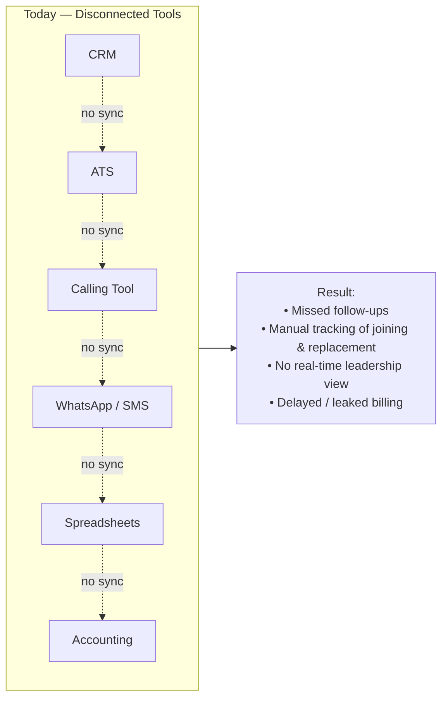
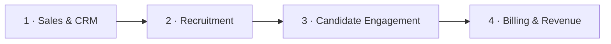
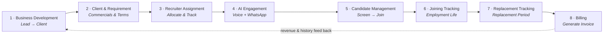
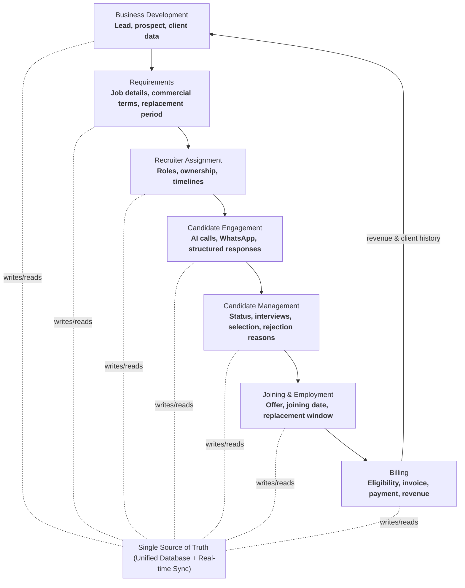
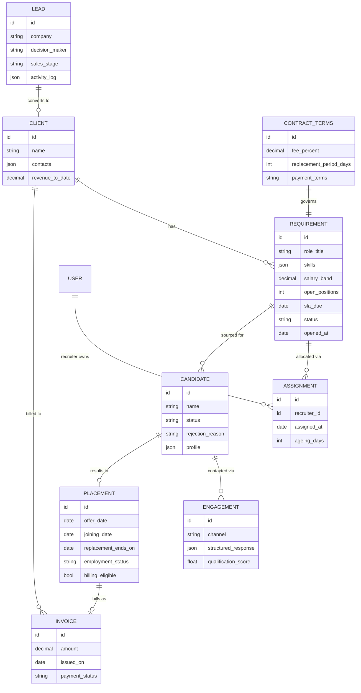
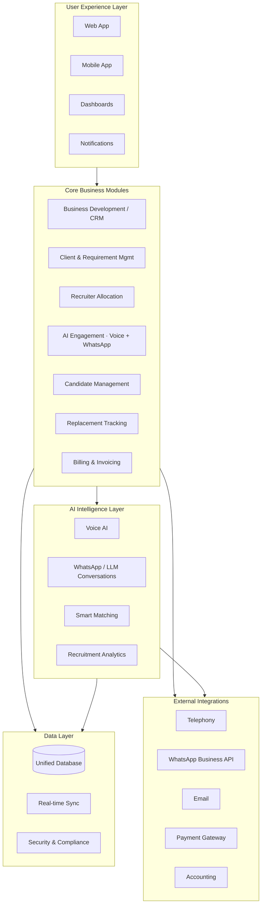
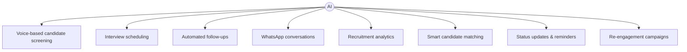
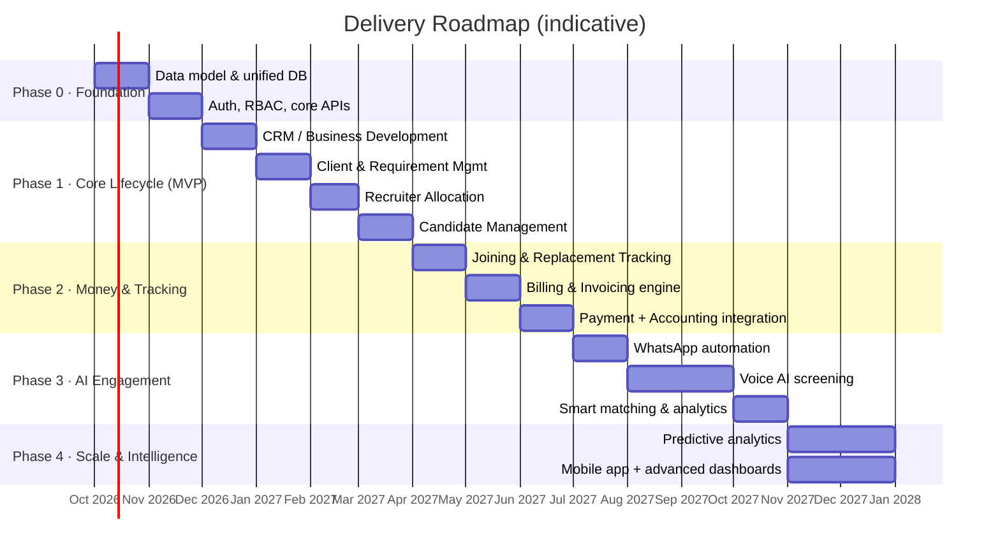

# The Recruitment Agency Operating System — Product Roadmap

> **Purpose of this document:** A single, presentation-ready roadmap that explains *what* we are building, *how* the data and work flow through it, *what each user does at every step*, and *in what sequence we will deliver it*. It is written so a technical or business stakeholder can understand the final product without any prior context.

> **Prepared by:** Forward Deployed Engineering / AI Engineering
> **Source of requirements:** White Paper — *"The Recruitment Agency Operating System — From Business Development to Candidate Billing."*
> **Status:** Draft v1.0 — for leadership review

---

## Table of Contents

1. [Executive Summary](#1-executive-summary)
2. [The Problem We Are Solving](#2-the-problem-we-are-solving)
3. [Product Vision & Definition](#3-product-vision--definition)
4. [User Personas & Roles](#4-user-personas--roles)
5. [End-to-End Workflow (Lead → Invoice)](#5-end-to-end-workflow-lead--invoice)
6. [Module-by-Module: What Each User Does](#6-module-by-module-what-each-user-does)
7. [Data Flow Across the Lifecycle](#7-data-flow-across-the-lifecycle)
8. [Core Data Model (Entities & Relationships)](#8-core-data-model-entities--relationships)
9. [Platform Architecture](#9-platform-architecture)
10. [The AI Layer — The Intelligence Engine](#10-the-ai-layer--the-intelligence-engine)
11. [External Integrations](#11-external-integrations)
12. [Non-Functional Requirements](#12-non-functional-requirements)
13. [Delivery Roadmap (Phased Plan)](#13-delivery-roadmap-phased-plan)
14. [Success Metrics & KPIs](#14-success-metrics--kpis)
15. [Risks, Assumptions & Mitigations](#15-risks-assumptions--mitigations)
16. [Glossary](#16-glossary)

---

## 1. Executive Summary

Recruitment agencies own the talent, the relationships and the domain expertise — but their operations are scattered across CRMs, spreadsheets, calling tools, messaging apps, ATS systems and accounting software. These tools do not talk to each other, which causes **missed follow-ups, poor visibility, manual tracking and delayed billing** — i.e. lost time and revenue leakage.

**The product** is a single, connected, AI-powered **Operating System for recruitment agencies** that runs the entire lifecycle — from business development to candidate billing — on one data spine.

**The three headline promises:**

| Promise | Meaning |
|---|---|
| **1 platform** | The full recruitment lifecycle lives in one system. |
| **AI-native** | Voice + WhatsApp engagement and analytics are built into the core, not bolted on. |
| **0 re-entry** | Data captured once flows through every stage — no re-keying between tools. |

**Outcome we are targeting:** More placements, higher recruiter productivity, faster time-to-hire, and guaranteed revenue capture through automated, contract-aware billing.

---

## 2. The Problem We Are Solving

| # | Problem | Business Consequence |
|---|---|---|
| 1 | **Fragmented systems** — CRM, ATS, calling, messaging, sheets, billing don't integrate | Data silos, re-entry, errors |
| 2 | **Manual tracking** — replacement periods, joining dates, invoices tracked in spreadsheets | Missed billing triggers, revenue leakage |
| 3 | **Limited visibility** — leadership has no real-time view of clients, requirements, candidates, revenue | Slow, reactive decisions |
| 4 | **Lost opportunities** — follow-ups missed, candidates drop off, billing delayed | Lower placements & slower growth |

---

## 3. Product Vision & Definition

**Vision statement:** *"One agency. One workflow. One source of truth."* — evolve from a recruitment tool into the operating infrastructure for modern recruitment agencies.

**What the product IS:**
- A unified operating system that connects **Sales & CRM → Recruitment → Candidate Engagement → Billing & Revenue**.
- An **AI-first** platform where voice and messaging automation do the repetitive outreach, screening and follow-ups.
- A **single source of truth** where every entity (lead, client, requirement, candidate, placement, invoice) is linked and observable end-to-end.

**What the product is NOT (scope guardrails):**
- Not a generic HRMS or payroll system for the *client's* employees.
- Not a job board / public careers site (though it can feed one).
- Not a standalone accounting suite — it *integrates* with accounting rather than replacing it.

**The four product pillars (from the white paper):**

---

## 4. User Personas & Roles

Understanding *who* uses the system is essential because every operation below is mapped to a role.

| Persona | Primary Goal | Key Screens They Live In |
|---|---|---|
| **Agency Founder / Leadership** | Real-time visibility into pipeline, productivity and revenue | Dashboards, revenue reports |
| **Business Development / Sales Rep** | Convert leads into clients and capture requirements | CRM pipeline, client & requirement forms |
| **Recruitment Manager / Team Lead** | Allocate requirements, balance workload, monitor ageing | Allocation board, productivity dashboards |
| **Recruiter** | Source, screen and move candidates to joining | Candidate pipeline, engagement console |
| **Finance / Billing Operator** | Generate correct invoices on time, track payments | Billing eligibility queue, invoice manager |
| **System Admin** | Manage users, roles, integrations, templates | Admin & settings |
| *(Automated actor)* **AI Agent** | Run voice/WhatsApp campaigns, capture structured responses | Runs in background; surfaces results to recruiters |

**Access model:** Role-Based Access Control (RBAC) — each role sees and edits only what is relevant, with leadership having read-across visibility.

---

## 5. End-to-End Workflow (Lead → Invoice)

The platform is built around **8 connected stages**. No stage requires re-entering data from the previous one.

**Narrative walk-through (the "real-world example"):**

1. **Lead** — A new company is added to the CRM with decision-maker details and a sales stage.
2. **Requirement** — The client shares an opening; terms, salary band, fee % and **replacement period** are captured.
3. **Recruiter Assignment** — A recruiter is assigned; candidates are sourced and contacted via **AI calls / WhatsApp**.
4. **Candidate Journey** — Candidate moves screening → interview → selection → offer → joining.
5. **Employment & Replacement** — System tracks the joining date and the replacement-guarantee window.
6. **Billing** — Once eligible per contract terms, the user clicks **"Generate Bill"** and an invoice is created with all details auto-filled.

**Result:** Faster hiring, full visibility, and on-time billing with no manual reconciliation.

---

## 6. Module-by-Module: What Each User Does

This section is the operational heart of the roadmap. For each module we define **the operations a user performs**, **the data captured**, and **what flows downstream**.

### 6.1 Business Development (CRM)

| Aspect | Detail |
|---|---|
| **Primary user** | BD / Sales Rep, Leadership |
| **User operations** | • Create & qualify leads/prospects • Move deals across pipeline stages (e.g. New → Contacted → Qualified → Won/Lost) • Log activities (calls, emails, meetings) and set follow-up reminders • Convert a won lead into a **Client** • View client history & revenue pipeline |
| **Data captured** | Company details, decision-maker contacts, sales stage, activity log, expected value |
| **Flows downstream** | A won lead becomes a **Client** record that seeds the Requirement module — no re-entry |
| **AI assist** | Follow-up reminders, re-engagement nudges, pipeline analytics |

### 6.2 Client & Requirement Management

| Aspect | Detail |
|---|---|
| **Primary user** | BD Rep, Recruitment Manager |
| **User operations** | • Capture client profile and **commercial terms** (fee %, flat fee, payment terms) • Create one or more **Requirements** (roles) under a client • Define role details: title, skills, salary band, location, count, timeline/SLA • Set the **replacement period** (guarantee window) per requirement • Link requirements to recruiters |
| **Data captured** | Commercial terms, replacement period, job spec, timelines, priority |
| **Flows downstream** | Requirements feed the Allocation module; commercial terms + replacement period feed the Billing engine's eligibility rules |
| **Why it matters** | The **contract terms captured once here drive automated billing later** — this is the anti-leakage mechanism |

### 6.3 Recruiter Allocation & Operations

| Aspect | Detail |
|---|---|
| **Primary user** | Recruitment Manager, Recruiter |
| **User operations** | • Assign requirements/roles to recruiters (with ownership & timelines) • Track candidate pipeline per requirement • Monitor recruiter productivity & workload balance • Track **requirement ageing** (how long a role stays open) |
| **Data captured** | Assignment ownership, per-recruiter load, interview counts, ageing timers |
| **Flows downstream** | Assigned recruiter + requirement context drive AI engagement targeting and candidate tracking |
| **AI assist** | Smart candidate matching, ageing/at-risk alerts |

### 6.4 AI-Powered Engagement (Voice + WhatsApp)

| Aspect | Detail |
|---|---|
| **Primary user** | Recruiter (initiates/oversees); **AI Agent** executes |
| **User operations** | • Launch **Voice AI calling campaigns** to shortlisted candidates • Trigger **WhatsApp** outreach, screening questions and follow-ups • Review **structured candidate responses** captured by AI • Approve AI-suggested next actions (schedule interview, advance, drop) |
| **Data captured** | Call transcripts, WhatsApp threads, structured answers (availability, notice period, expected CTC, interest), sentiment/qualification score |
| **Flows downstream** | Structured responses update the candidate's status and profile in Candidate Management automatically |
| **AI assist** | This module **is** the AI layer in action — screening, scheduling, follow-ups, re-engagement |

### 6.5 Candidate Management

| Aspect | Detail |
|---|---|
| **Primary user** | Recruiter, Recruitment Manager |
| **User operations** | • Track candidates through the full journey: Sourced → Screened → Interview → Selected → Offered → Joined (or Rejected) • Record **rejection reasons** for analytics • Attach documents, notes, interview feedback • Move candidate between requirements if relevant |
| **Data captured** | Status, interview outcomes, rejection reasons, selection details, offer details |
| **Flows downstream** | A "Selected/Offered" candidate creates the basis for a **Placement**, feeding Joining Tracking |
| **AI assist** | Status update reminders, drop-off prediction, rejection-reason analytics |

### 6.6 Joining & Employment Tracking

| Aspect | Detail |
|---|---|
| **Primary user** | Recruiter, Recruitment Manager |
| **User operations** | • Record offer, documentation and **joining date** • Track employment life post-joining • Monitor whether the candidate is still active during the guarantee window |
| **Data captured** | Offer date, joining date, employment status, replacement-clock start |
| **Flows downstream** | Joining date + replacement period start the **Replacement Tracking** clock and feed the Billing eligibility check |

### 6.7 Replacement Tracking

| Aspect | Detail |
|---|---|
| **Primary user** | Recruitment Manager, Finance |
| **User operations** | • Monitor the **replacement period** countdown per placement • Handle "candidate left within guarantee" → trigger replacement requirement • Confirm when the guarantee window is safely cleared |
| **Data captured** | Replacement window status, breaches, replacement linkage |
| **Flows downstream** | Successful clearance (or contract-defined milestone) makes the placement **billing-eligible** |

### 6.8 Billing & Invoicing

| Aspect | Detail |
|---|---|
| **Primary user** | Finance / Billing Operator, Leadership |
| **User operations** | • Review the **billing-eligibility queue** (system checks contract terms automatically) • Click **"Generate Bill"** → invoice auto-filled with client, role, candidate, fee and terms • Send invoice; track payment status & revenue • Sync to accounting system |
| **Data captured** | Invoice line items, amounts, dates, payment status |
| **Flows downstream** | Revenue data feeds leadership dashboards and closes the loop back to BD (client revenue history) |
| **Why it matters** | Eligibility is **contract-aware** (uses terms + joining date + replacement window), which is what eliminates revenue leakage |

---

## 7. Data Flow Across the Lifecycle

The core principle: **capture once, reuse everywhere.** Each stage enriches the same connected record set.

**Key data-flow rules:**
- **No re-entry:** Client and commercial terms captured in Requirements are the same records used at Billing.
- **Event-driven triggers:** A joining date event starts the replacement clock; clearance/milestone events flip a placement to billing-eligible.
- **Bidirectional intelligence:** Billing/revenue history flows *back* to CRM so BD can prioritize high-value clients.

---

## 8. Core Data Model (Entities & Relationships)

A simplified logical model that supports every workflow above.

**Entity notes:**
- `CONTRACT_TERMS` is deliberately its own entity so billing logic reads authoritative terms rather than duplicated fields.
- `PLACEMENT.billing_eligible` is a **derived flag** set by the billing rules engine (contract terms + joining date + replacement window).
- `ENGAGEMENT.structured_response` is what the AI layer writes back so recruiters never re-key screening answers.

---

## 9. Platform Architecture

A modular, scalable, layered architecture (mirrors the white paper's four layers).

**Architectural principles:**
- **Modular services** — each core module is independently deployable/scalable but shares the unified data layer.
- **Event-driven backbone** — stage transitions (e.g., "candidate joined") emit events consumed by downstream modules (replacement clock, billing).
- **API-first** — every capability is exposed via internal APIs so the web app, mobile app and integrations reuse the same contracts.
- **Real-time sync** — dashboards reflect current state without manual refresh/reconciliation.

---

## 10. The AI Layer — The Intelligence Engine

AI is a **core engine**, not a feature. It reduces manual effort so humans focus on high-value interactions.

**Engineering breakdown of each AI capability:**

| Capability | How it works (engineering view) | Output written to system |
|---|---|---|
| **Voice AI screening** | Outbound voice agent (TTS + STT + LLM dialog manager) runs a scripted-but-adaptive screening call | Transcript + structured fields (availability, notice, CTC, interest) + qualification score |
| **WhatsApp conversations** | LLM-driven conversational flows over WhatsApp Business API; handles Q&A, doc collection, nudges | Threaded messages + structured answers |
| **Smart matching** | Embedding/similarity + rules over requirement spec vs candidate profiles | Ranked candidate shortlist per requirement |
| **Interview scheduling** | Calendar-aware slot proposal + confirmation over voice/WhatsApp/email | Scheduled interview events |
| **Automated follow-ups & reminders** | Event/time-triggered outreach when a stage stalls | Follow-up activity logs, status nudges |
| **Re-engagement campaigns** | Reactivate dormant candidates/leads via targeted outreach | New engagements, revived pipeline |
| **Recruitment analytics** | Aggregations + predictive signals (drop-off risk, ageing, conversion) | Dashboard insights & alerts |

**Guardrails (AI engineering responsibilities):**
- **Human-in-the-loop** for advancing/rejecting candidates and sending invoices.
- **Consent & compliance** for automated calls/messages (opt-out handling, quiet hours).
- **Structured extraction validation** — AI output is schema-validated before it updates candidate records.
- **Auditability** — every AI action is logged with transcript/prompt lineage.

---

## 11. External Integrations

| Integration | Purpose | Where it plugs in |
|---|---|---|
| **Telephony** | Place/receive voice calls for the Voice AI agent | AI Engagement module |
| **WhatsApp Business API** | Automated candidate/client messaging | AI Engagement module |
| **Email** | Formal comms, offer/interview mails, invoice delivery | CRM, Candidate Mgmt, Billing |
| **Payment Gateway** | Collect/track payments against invoices | Billing module |
| **Accounting** | Push invoices & revenue to the agency's books | Billing module |

**Integration strategy:** adapter pattern — each provider sits behind a stable internal interface so providers can be swapped without touching business logic.

---

## 12. Non-Functional Requirements

| Category | Requirement |
|---|---|
| **Security & Compliance** | RBAC, encryption in transit & at rest, PII handling for candidate data, consent tracking for automated outreach, audit trails |
| **Scalability** | Built to grow with more clients, roles, recruiters and teams; horizontally scalable core services |
| **Reliability** | Event-driven triggers must be durable (no lost "joining"/"billing-eligible" events) |
| **Performance** | Real-time dashboard sync; responsive UI on web & mobile |
| **Observability** | Logging, metrics and alerting across modules and AI actions |
| **Data integrity** | Single source of truth; derived flags (billing eligibility) recomputed deterministically |
| **Auditability** | Every stage transition, AI action and invoice is traceable |

---

## 13. Delivery Roadmap (Phased Plan)

Aligned to the white paper's vision timeline: **Today → Next 12 months → 1–3 years → 3+ years.** The phases below sequence *build* work to de-risk delivery and show value early.

**Phase intent & exit criteria:**

| Phase | Goal | "Done" means |
|---|---|---|
| **0 · Foundation** | The data spine & security | Unified schema, RBAC, core APIs live |
| **1 · Core Lifecycle (MVP)** | Run a placement end-to-end *manually* | A user can go Lead → Requirement → Assign → Candidate → Selected without spreadsheets |
| **2 · Money & Tracking** | Capture revenue reliably | Joining/replacement tracked; contract-aware invoice generated & synced to accounting |
| **3 · AI Engagement** | Automate outreach & screening | WhatsApp + Voice AI produce structured responses that update candidate records |
| **4 · Scale & Intelligence** | Predict & scale | Predictive analytics, mobile, richer dashboards for multi-team agencies |

> **Sequencing rationale (FDE view):** We deliver the *connected lifecycle and billing* (the revenue-leakage fix and the biggest visibility win) **before** the AI engagement layer. This proves the "single source of truth" value fast, gives the AI layer clean structured data to write into, and means every AI feature lands on a system that can already act on its output.

---

## 14. Success Metrics & KPIs

Illustrative target ranges the platform is designed to help agencies reach (actual results depend on each agency's starting point).

| Category | KPI | Target |
|---|---|---|
| **Sales & BD** | Lead conversion rate | 25–40% |
| | Active clients | 50+ |
| | Revenue pipeline | Rs. Cr scale |
| **Recruitment** | Time to fill | 7–15 days |
| | Offer-to-join rate | 30–50% |
| | Placement ratio | 70–90% |
| **Operational Efficiency** | Manual work reduction | 60–80% |
| | Recruiter productivity | 2–3× |
| | Requirement ageing | < 3 days |
| **Revenue & Financials** | Billable candidates | 90%+ |
| | Invoice cycle time | 1–2 days |
| | Revenue growth | 20–40% |

**How the product moves each KPI:** connected data + AI outreach shorten time-to-fill and boost productivity; contract-aware billing raises billable % and shrinks invoice cycle time; real-time dashboards drive the ageing and conversion improvements.

---

## 15. Risks, Assumptions & Mitigations

| Risk / Assumption | Impact | Mitigation |
|---|---|---|
| Voice AI quality varies by language/accent | Poor screening experience | Start with WhatsApp automation (Phase 3a) before Voice; human review of low-confidence calls |
| Telephony/WhatsApp compliance (consent, spam rules) | Legal/deliverability risk | Consent capture, opt-out, quiet hours, per-region policy |
| Contract terms are complex/varied per client | Billing errors | Model `CONTRACT_TERMS` explicitly; rules engine with test coverage; human approval before invoice send |
| Data migration from legacy spreadsheets/CRMs | Adoption friction | Import tooling + mapping in Phase 1 |
| Over-automation erodes trust | Users bypass system | Human-in-the-loop on advance/reject/invoice; full audit trail |
| Assumption: agencies want one system | Wrong bet | Validated by white paper problem statement; MVP proves value before AI investment |

---

## 16. Glossary

| Term | Meaning |
|---|---|
| **Requirement** | A specific role/opening a client wants filled |
| **Replacement period** | Contractual guarantee window in which a departed placement must be replaced free |
| **Placement** | A candidate who has been selected/offered/joined for a requirement |
| **Billing eligibility** | Derived state confirming an invoice can be raised per contract terms |
| **Requirement ageing** | How long a requirement has stayed open/unfilled |
| **Structured response** | Machine-readable answers extracted by AI from calls/chats |
| **Single source of truth (SSOT)** | The unified database all modules read from and write to |

---

### One-line summary for leadership

> **We are building the operating system for recruitment agencies: one connected workflow from lead to invoice, an AI layer that runs voice + WhatsApp engagement, and contract-aware automated billing — delivered in phases that prove revenue and visibility value first, then layer in AI automation.**
