# Recruitment OS — Recruiter Flow & Screens

**Companion to:** the *Recruitment OS* white paper (v1.0) · `../RECRUITMENT_OS_ROADMAP.md` · `../DATA_FORMAT_AND_SPREADSHEET_UI_DESIGN.md`
**Scope of this document:** the **Recruiter flow**, end to end, with a rendered screen for every step.
**Build priority:** **1) Recruiter flow (this doc) → 2) Billing department → 3) BDE / Sales (future scope).**

> **Why this scope.** The white paper covers 10 stages across four teams. You asked us to ship value to **recruiters first**, then **billing**, and treat **BDE / Sales** (lead capture, client onboarding, contract terms) as **future scope**. So the whole **BDE module is marked _future scope_ everywhere** in this document — the greyed `Sales · Soon` item in the menu, and the faded block in the overview. Recruiters are never blocked waiting for it: a role can arrive by **data upload** or a quick manual add.

---

## 0 · The whole recruiter journey on one page

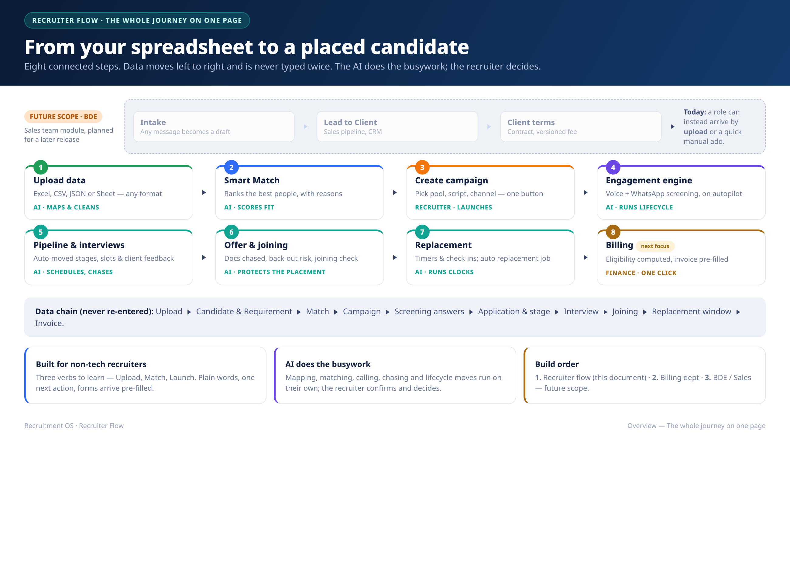

Eight connected steps. Data moves left to right and is **never typed twice**. The recruiter learns just three verbs — **Upload → Match → Launch** — and the AI does the busywork in between.

| # | Step | Owner | What the AI does |
|---|------|-------|------------------|
| 1 | **Upload data** (Excel/CSV/JSON) | Recruiter / Team Lead | Reads any format, maps columns, cleans & de-duplicates |
| 2 | **Smart Match** | Recruiter | Ranks the best candidates for a role, with reasons |
| 3 | **Create campaign** | Recruiter | Bundles the pool + script + channel; checks consent |
| 4 | **Engagement engine** | Automation | Voice + WhatsApp screening; advances the lifecycle on its own |
| 5 | **Pipeline & interviews** | Recruiter | Auto-moves stages, books slots, chases client feedback |
| 6 | **Offer & joining** | Recruiter | Chases documents, flags back-out risk, confirms joining |
| 7 | **Replacement** | Automation | Runs guarantee-period timers; auto-creates a replacement job |
| 8 | **Billing** *(next focus)* | Finance | Computes eligibility, pre-fills the invoice |

> **Future scope · BDE.** Intake → Lead → Client → Contract terms sit *before* step 1 and belong to the Sales team. They are planned for a later release and are shown faded in the overview.

---

## Design principles for non-technical recruiters

Recruiters are not spreadsheet engineers, so every screen obeys the same rules:

1. **Three verbs, not a manual** — *Upload, Match, Launch*. Everything else is a suggestion or an automation.
2. **One next action per record** — a single coloured button (red = do now, amber = waiting, green = quick win). Never a blank form.
3. **Plain words, not jargon** — "Find matching candidates", "Bring your data", "Review & fix".
4. **Type nothing twice** — each screen is pre-filled from the previous one; the recruiter confirms or corrects.
5. **AI drafts, human confirms** — every AI value carries a confidence chip and can be edited; money and commitments always wait for a person.
6. **Same layout everywhere** — header, status, one primary action, timeline. Learn one screen, know them all.

The menu a recruiter sees has seven items — **Today, My Data, Requirements, Candidates, Interviews, Billing, Reports** — plus a greyed **Sales · Soon** to signal the BDE module is coming later.

---

## Step 1 · Home ("Today")

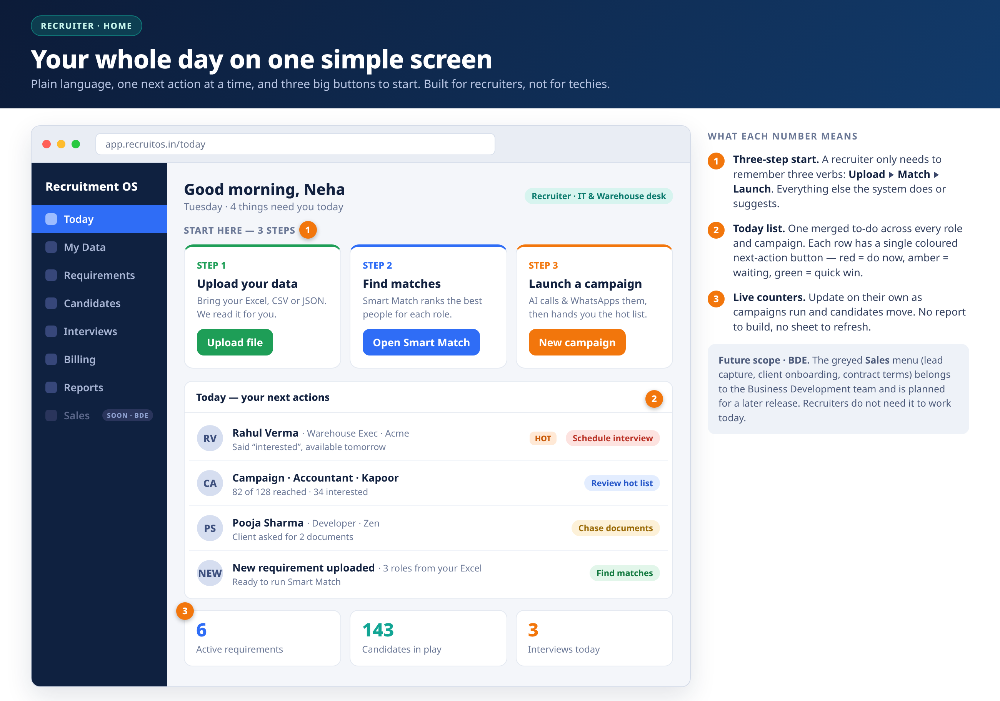

**Flow — what happens:** the recruiter lands on one screen that merges every open task across all roles and campaigns. Three big buttons start the core loop; the Today list shows what needs a human now; live counters update on their own.

- **① Three-step start** — Upload → Match → Launch, the only workflow a recruiter must remember.
- **② Today list** — one merged to-do; each row has a single coloured next-action button.
- **③ Live counters** — active requirements, candidates in play, interviews today; no report to build.
- **Future scope · BDE** — the greyed *Sales* menu (lead capture, client onboarding, contract terms) is a later release.

---

## Step 1a–1c · Bring your data in any format

This is the entry point that replaces the (future-scope) BDE hand-off: **TLs and recruiters upload their existing spreadsheets** and the system turns them into clean, shared records. Multi-format upload is a guided **4-step wizard**: *Upload → Map columns → Review & fix → Done.*

### Upload — any format

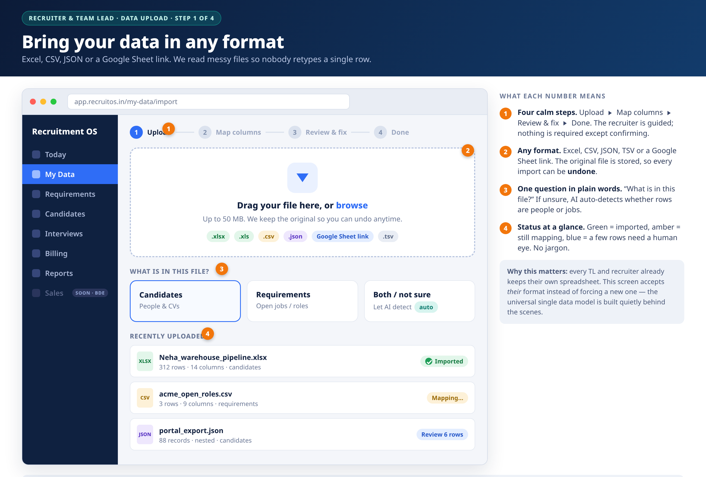

- **① Four calm steps** — the recruiter is guided; the only requirement is to confirm.
- **② Any format** — `.xlsx`, `.xls`, `.csv`, `.json`, `.tsv`, or a **Google Sheet link**. The original file is stored, so every import can be **undone**.
- **③ One plain question** — "What is in this file?" (Candidates / Requirements / auto-detect).
- **④ Status at a glance** — green = imported, amber = mapping, blue = a few rows need a look.

**Under the hood:** files are parsed client-side (Excel via SheetJS, CSV via a streaming parser, JSON natively) and **staged** — nothing touches the live database until the recruiter confirms.

### Map columns — the AI lines up your headers

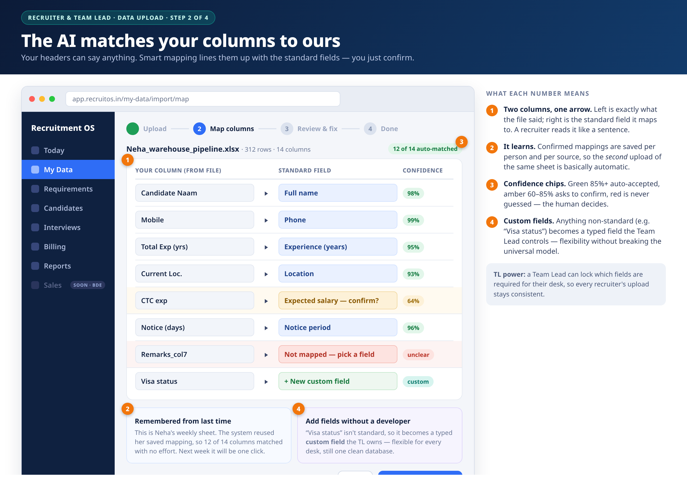

Your headers can say anything ("Candidate Naam", "CTC exp", "Mobile"); the AI proposes the standard field for each and you just confirm.

- **① Two columns, one arrow** — left is exactly what the file said, right is the standard field. Reads like a sentence.
- **② It learns** — confirmed mappings are saved per person and per source, so the *second* upload of the same sheet is basically one click.
- **③ Confidence chips** — green 85%+ auto-accepted, amber 60–85% asks to confirm, red is never guessed.
- **④ Custom fields** — anything non-standard (e.g. "Visa status") becomes a **typed custom field the TL owns** — flexibility without breaking the universal model.

### Review & fix — we clean the mess, you check a handful of rows

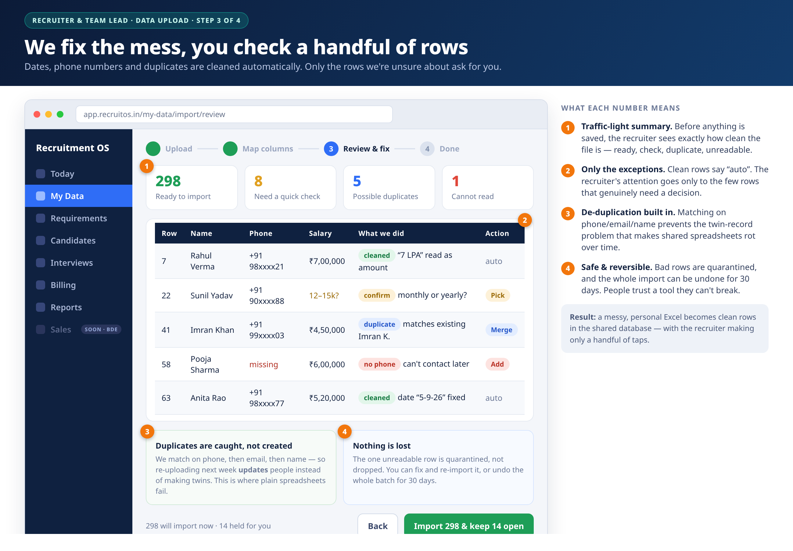

- **① Traffic-light summary** — ready / needs a check / possible duplicate / unreadable, *before* anything is saved.
- **② Only the exceptions** — clean rows say "auto"; attention goes only where a decision is genuinely needed.
- **③ De-duplication built in** — match on phone → email → name, so re-uploading next week **updates** people instead of creating twins (the exact failure of shared spreadsheets).
- **④ Safe & reversible** — bad rows are quarantined, and the whole batch can be undone for 30 days.

> **This is the "universal, yet flexible data format" problem solved in practice:** the recruiter uses *their own* Excel; the system quietly maps it into one clean, shared model.

### Team Lead · Data & Format control

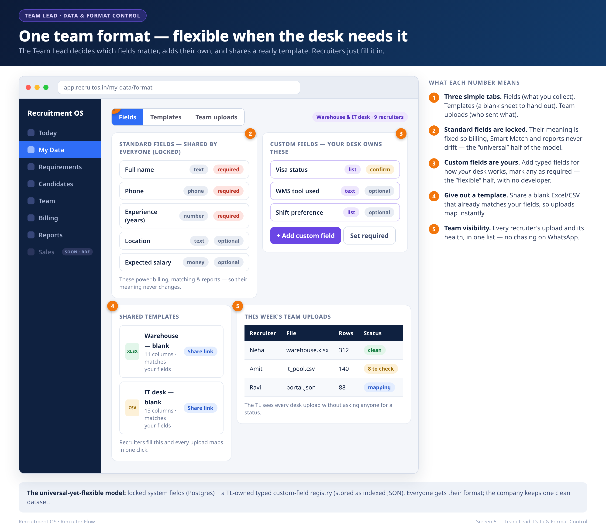

The TL is where **flexibility is governed** so it never becomes chaos.

- **① Three simple tabs** — Fields (what you collect), Templates (a blank sheet to hand out), Team uploads (who sent what).
- **② Standard fields are locked** — their meaning is fixed, so billing, Smart Match and reports never drift (the **universal** half).
- **③ Custom fields are the desk's** — add typed fields, mark any required, with no developer (the **flexible** half).
- **④ Give out a template** — share a blank Excel/CSV that already matches the desk's fields, so uploads map instantly.
- **⑤ Team visibility** — every recruiter's upload and its health in one list; no chasing on WhatsApp.

**The model:** locked system fields (Postgres) **+** a TL-owned typed custom-field registry (stored as indexed JSON). *Everyone gets their format; the company keeps one clean dataset.*

---

## Step 2 · The requirement (the role to fill)

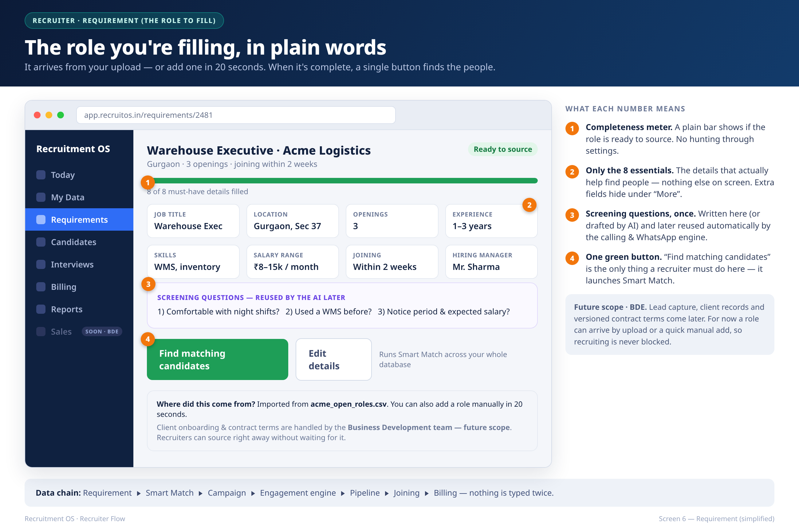

A requirement arrives from the upload (or a 20-second manual add). It shows only the essentials and a completeness meter.

- **① Completeness meter** — a plain bar shows if the role is ready to source.
- **② The 8 essentials** — only the details that help find people; extras hide under "More".
- **③ Screening questions, once** — written here (or drafted by AI), later reused by the calling & WhatsApp engine.
- **④ One green button** — "Find matching candidates" launches Smart Match.

> **Future scope · BDE.** Client records and versioned contract terms are added later by the Sales team. Recruiting is never blocked on them.

---

## Step 3 · Smart Match

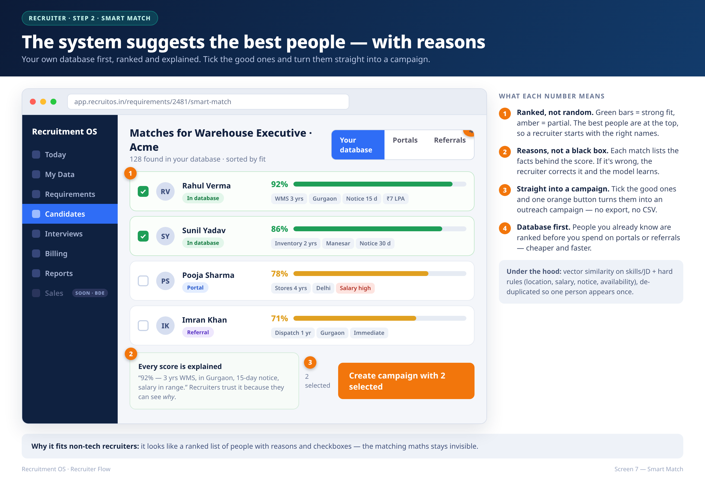

The system suggests the best people from your own database first — ranked and **explained**.

- **① Ranked, not random** — green bars = strong fit, amber = partial; best people at the top.
- **② Reasons, not a black box** — every score lists the facts behind it; correcting it teaches the model.
- **③ Straight into a campaign** — tick the good ones and one button turns them into outreach (no export, no CSV).
- **④ Database first** — people you already know are ranked before you pay for portals or referrals.

**Under the hood:** vector similarity on skills/JD **+** hard rules (location, salary, notice, availability), de-duplicated so each person appears once.

---

## Step 3b · Create a campaign

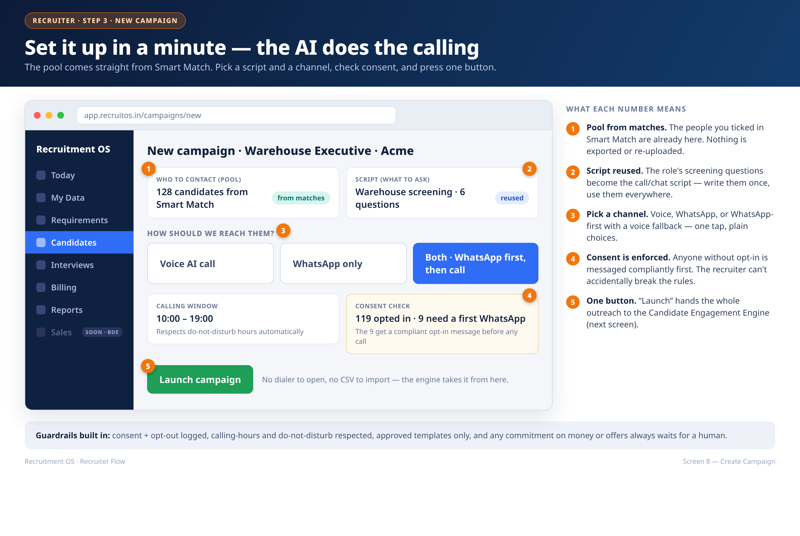

- **① Pool from matches** — the people you ticked are already here.
- **② Script reused** — the role's screening questions become the call/chat script.
- **③ Pick a channel** — Voice, WhatsApp, or WhatsApp-first with a voice fallback.
- **④ Consent enforced** — anyone without opt-in is messaged compliantly first; the recruiter can't break the rules by accident.
- **⑤ One button** — "Launch" hands the outreach to the engagement engine.

**Guardrails built in:** consent + opt-out logged, calling-hours & do-not-disturb respected, approved templates only, and any commitment on money/offers always waits for a human.

---

## Step 4 · Candidate Engagement Engine (runs on its own)

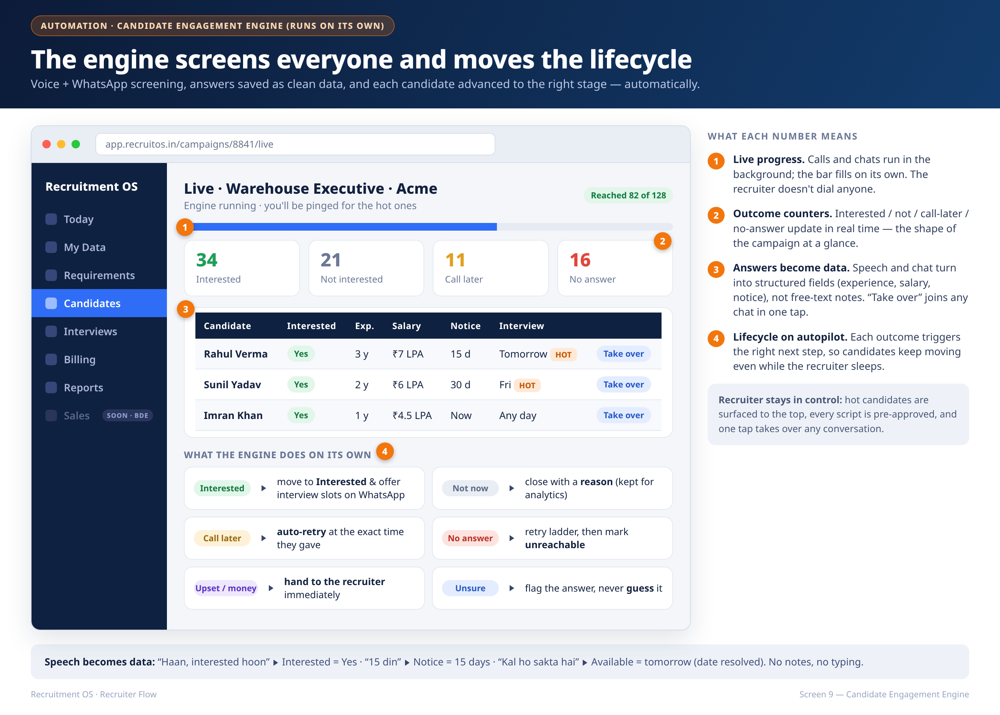

This is the automation heart: after **Launch**, the engine screens everyone over voice + WhatsApp, turns answers into clean data, and **advances each candidate to the right stage automatically**.

- **① Live progress** — calls and chats run in the background; the recruiter dials no one.
- **② Outcome counters** — interested / not / call-later / no-answer, in real time.
- **③ Answers become data** — speech and chat become structured fields (experience, salary, notice), not notes. "Take over" joins any chat in one tap.
- **④ Lifecycle on autopilot** — each outcome fires the right next step (see the state machine below).

### How the engine manages the lifecycle

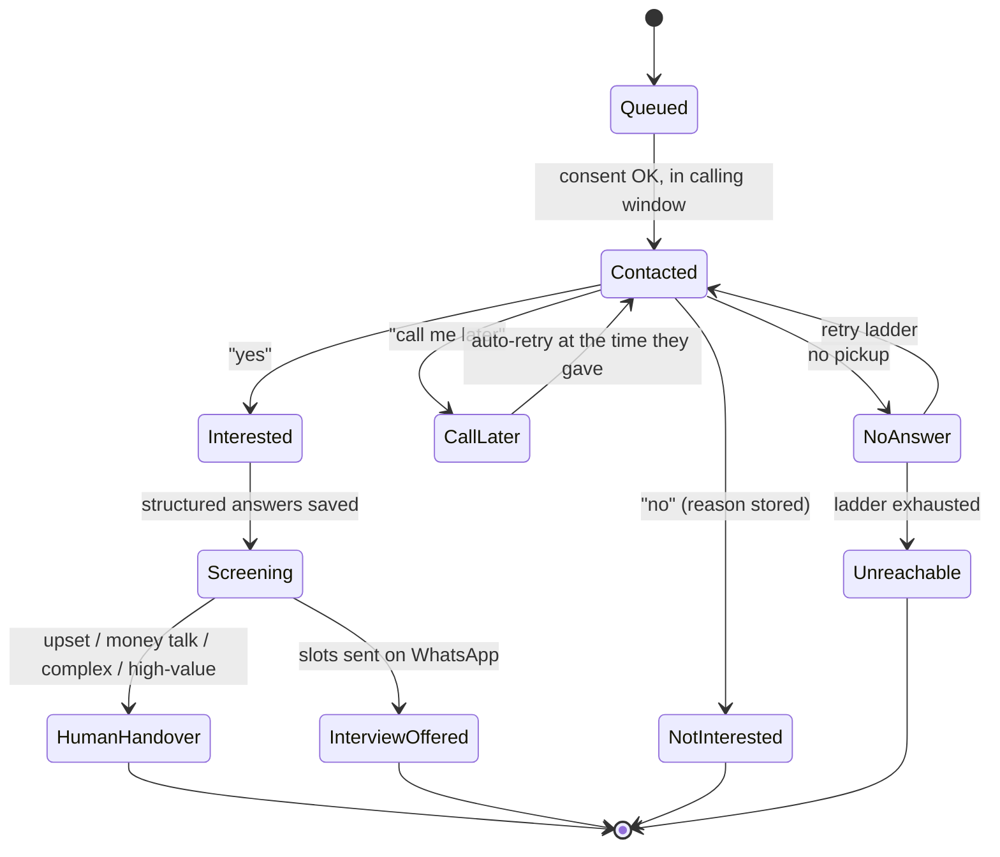
```mermaid
stateDiagram-v2
    [*] --> Queued
    Queued --> Contacted: consent OK, in calling window
    Contacted --> Interested: "yes"
    Contacted --> NotInterested: "no" (reason stored)
    Contacted --> CallLater: "call me later"
    Contacted --> NoAnswer: no pickup
    CallLater --> Contacted: auto-retry at the time they gave
    NoAnswer --> Contacted: retry ladder
    NoAnswer --> Unreachable: ladder exhausted
    Interested --> Screening: structured answers saved
    Screening --> HumanHandover: upset / money talk / complex / high-value
    Screening --> InterviewOffered: slots sent on WhatsApp
    HumanHandover --> [*]
    InterviewOffered --> [*]
    NotInterested --> [*]
    Unreachable --> [*]
```

**Recruiter stays in control:** hot candidates rise to the top, every script is pre-approved, and one tap takes over any conversation. Low-confidence answers are flagged, never guessed.

---

## Step 5 · Pipeline & interviews

### The board — moved for you

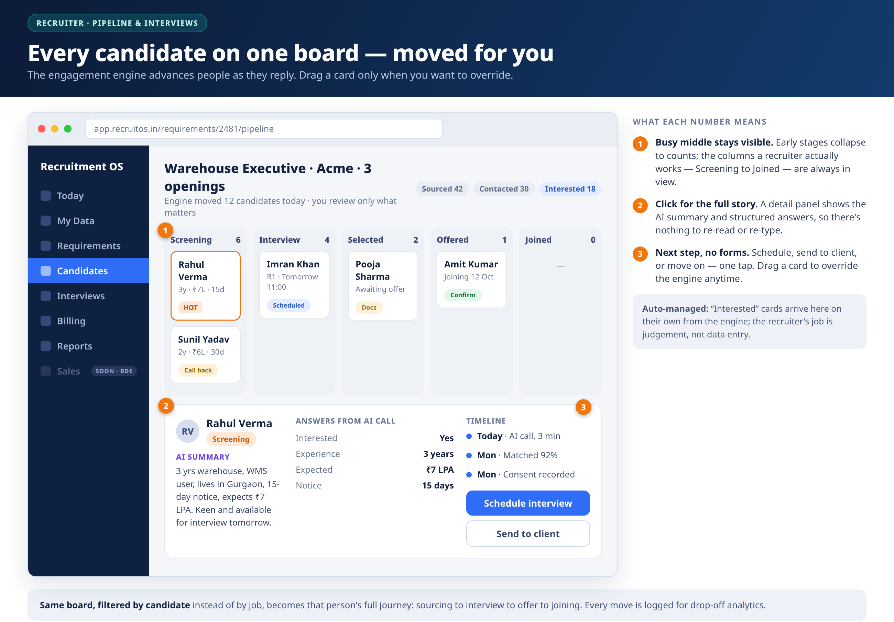

- **① Busy middle stays visible** — early stages collapse to counts; Screening → Joined always in view.
- **② Click for the full story** — a detail panel shows the AI summary and structured answers.
- **③ Next step, no forms** — schedule, send to client, or move on; drag to override the engine anytime.
- **Auto-managed** — "Interested" cards arrive here on their own from the engine.

### Interviews & client feedback — no back-and-forth

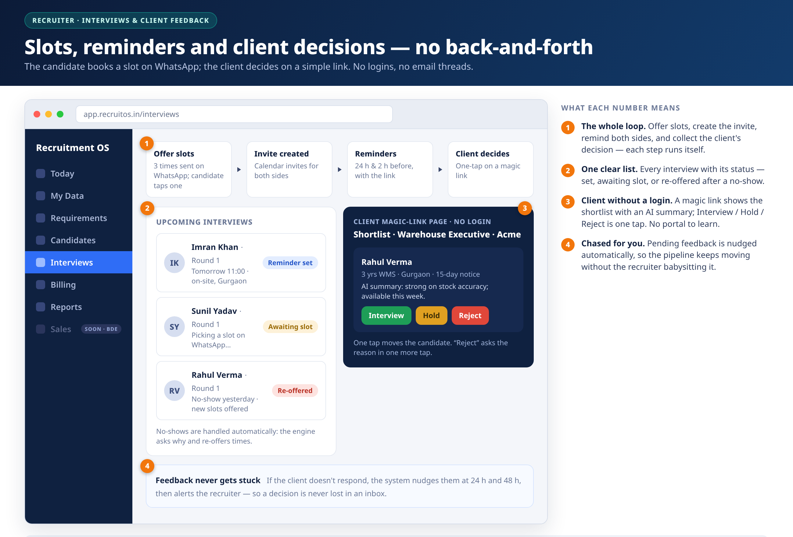

- **① The whole loop** — offer slots, create the invite, remind both sides, collect the client's decision.
- **② One clear list** — every interview with its status (set / awaiting slot / re-offered after no-show).
- **③ Client without a login** — a **magic link** shows the shortlist with an AI summary; Interview / Hold / Reject in one tap.
- **④ Chased for you** — pending feedback is nudged at 24 h and 48 h, then escalated.

---

## Step 6 · Offer & joining

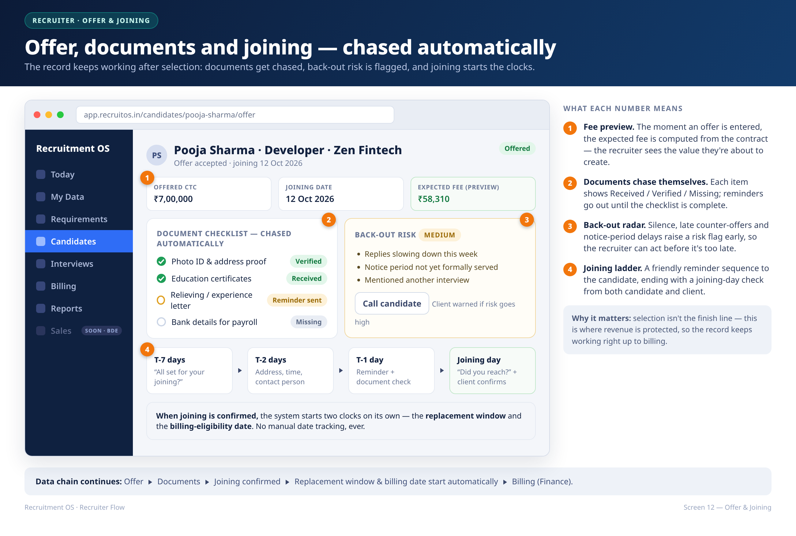

- **① Fee preview** — the expected fee is computed from the contract the moment an offer is entered.
- **② Documents chase themselves** — each item shows Received / Verified / Missing; reminders go until complete.
- **③ Back-out radar** — silence, late counter-offers and notice-period delays raise a risk flag early.
- **④ Joining ladder** — T-7 / T-2 / T-1 / joining-day checks with candidate and client.

When joining is confirmed, the system starts two clocks on its own — the **replacement window** and the **billing-eligibility date**. No manual date tracking.

---

## Step 7 · Replacement tracking (runs on its own)

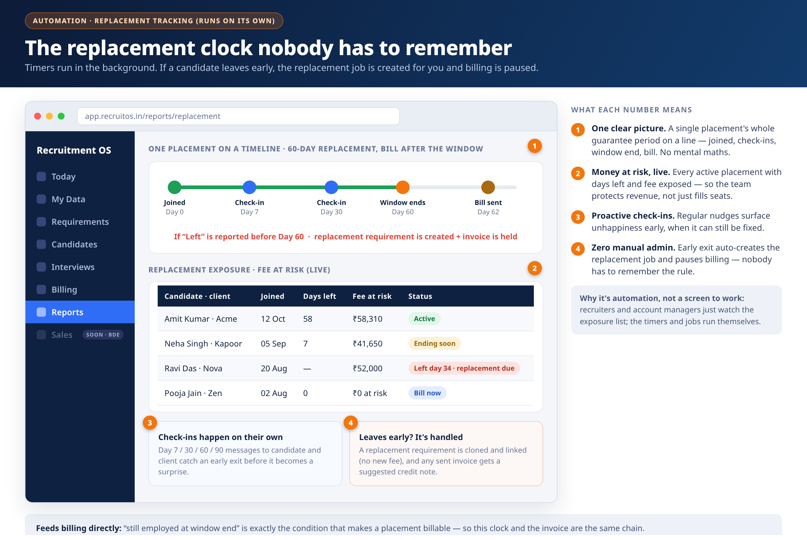

- **① One clear picture** — a placement's whole guarantee period on a line.
- **② Money at risk, live** — every active placement with days left and fee exposed.
- **③ Proactive check-ins** — Day 7 / 30 / 60 / 90 messages catch an early exit before it's a surprise.
- **④ Zero manual admin** — an early exit auto-creates the replacement job (no new fee) and pauses billing.

"Still employed at window end" is exactly the condition that makes a placement billable — so this clock and the invoice are the same chain.

---

## Step 8 · Billing handoff *(next build focus — Finance owns it)*

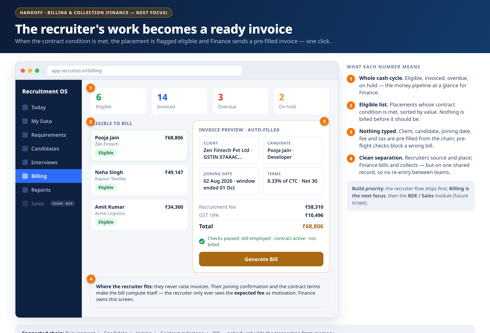

- **① Whole cash cycle** — eligible / invoiced / overdue / on hold.
- **② Eligible list** — placements whose contract condition is met, sorted by value.
- **③ Nothing typed** — client, candidate, joining date, fee and tax pre-filled; pre-flight checks block a wrong bill.
- **④ Clean separation** — recruiters source and place; Finance bills and collects — on one shared record, so no re-entry.

> The recruiter **never raises invoices**. Their joining confirmation + the contract terms make the bill compute itself; the recruiter only sees the **expected fee** as motivation.

---

## Data model tie-in (why nothing is typed twice)

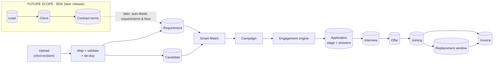
```mermaid
flowchart LR
    UP["Upload<br/>(xlsx/csv/json)"] --> MAP["Map + validate<br/>+ de-dup"]
    MAP --> CAND[(Candidate)]
    MAP --> REQ[(Requirement)]
    REQ --> MATCH["Smart Match"]
    CAND --> MATCH
    MATCH --> CAMP["Campaign"]
    CAMP --> ENG["Engagement engine"]
    ENG --> APP[(Application<br/>stage + answers)]
    APP --> INT[(Interview)]
    INT --> OFF[(Offer)]
    OFF --> JOIN[(Joining)]
    JOIN --> REPL[(Replacement window)]
    JOIN --> INV[(Invoice)]
    REPL --> INV
    subgraph FUTURE["FUTURE SCOPE · BDE (later release)"]
        LEAD[(Lead)] --> CLIENT[(Client)] --> TERMS[(Contract terms)]
    end
    TERMS -. "later: auto-feeds requirements & fees" .-> REQ
```

- **Candidate ≠ Application** — one person can be in many jobs; stage, score and answers live on the Application, so nothing is overwritten.
- **Custom fields** — desk-specific fields (TL-owned) attach to Candidate/Requirement as typed JSON, indexed for search.
- **Money hangs off Joining** — the invoice is computed from the joining date + contract trigger; no joining, no eligibility.

---

## Multi-format upload — technical spec (for engineering)

| Concern | Approach |
|---|---|
| **Formats** | `.xlsx`/`.xls` (SheetJS), `.csv`/`.tsv` (streaming parser, e.g. Papa Parse), `.json` (native, incl. nested), Google Sheet link (Sheets API read) |
| **Where parsed** | Client-side into a **staged batch**; the live DB is untouched until confirm |
| **Column mapping** | Heuristic + embedding matcher proposes `source header → canonical field`; confidence chips gate auto-accept (≥85%), confirm (60–85%), never-guess (<60%) |
| **Mapping memory** | Confirmed mappings saved as a **template** keyed to user + file signature → one-click re-imports |
| **Custom fields** | Non-standard headers become typed fields in a TL-scoped registry (text/number/date/list/money/boolean); stored as indexed JSON on the entity |
| **Validation** | Per-field type coercion (dates, currency, phone), enum snapping, required checks; failures quarantined, not dropped |
| **De-duplication** | Entity resolution on phone → email → name+context; re-imports update instead of duplicating |
| **Reversibility** | Every batch is a staged, undoable transaction for 30 days |

*(Rationale and market comparison — Airtable's flexibility vs. its dedup/scale weaknesses, embedded importers like Flatfile/OneSchema, and the AG Grid vs. Univer spreadsheet-UI choice — are in `../DATA_FORMAT_AND_SPREADSHEET_UI_DESIGN.md`.)*

---

## Build order & what's explicitly deferred

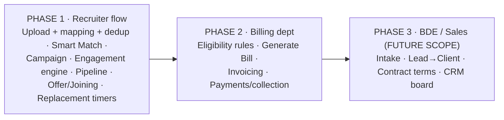
```mermaid
flowchart LR
    P1["PHASE 1 · Recruiter flow<br/>Upload + mapping + dedup · Smart Match ·<br/>Campaign · Engagement engine · Pipeline ·<br/>Offer/Joining · Replacement timers"]
    P2["PHASE 2 · Billing dept<br/>Eligibility rules · Generate Bill ·<br/>Invoicing · Payments/collection"]
    P3["PHASE 3 · BDE / Sales (FUTURE SCOPE)<br/>Intake · Lead→Client · Contract terms · CRM board"]
    P1 --> P2 --> P3
```

| Area | Status in this document |
|---|---|
| Recruiter data upload (Excel/CSV/JSON) | **In scope — Phase 1** |
| Smart Match + campaigns | **In scope — Phase 1** |
| Candidate engagement engine (auto lifecycle) | **In scope — Phase 1** |
| Pipeline, interviews, offer, joining, replacement | **In scope — Phase 1** |
| Billing & collection | **Next focus — Phase 2** |
| **BDE / Sales** (intake, lead→client, contract terms, CRM) | **FUTURE SCOPE — Phase 3** |

---

## Screen index

| # | Screen | File |
|---|--------|------|
| — | Overview | `assets/img/00-overview.png` |
| 1 | Home / Today | `assets/img/01-home.png` |
| 2 | Data upload (multi-format) | `assets/img/02-import-upload.png` |
| 3 | Smart column mapping | `assets/img/03-import-mapping.png` |
| 4 | Review, validate & de-dup | `assets/img/04-import-review.png` |
| 5 | Team Lead — data & format control | `assets/img/05-tl-templates.png` |
| 6 | Requirement (simplified) | `assets/img/06-requirement.png` |
| 7 | Smart Match | `assets/img/07-smart-match.png` |
| 8 | Create campaign | `assets/img/08-campaign-new.png` |
| 9 | Candidate engagement engine | `assets/img/09-engagement-engine.png` |
| 10 | Pipeline board | `assets/img/10-pipeline.png` |
| 11 | Interviews & client feedback | `assets/img/11-interview.png` |
| 12 | Offer & joining | `assets/img/12-offer-joining.png` |
| 13 | Replacement tracking | `assets/img/13-replacement.png` |
| 14 | Billing handoff (Finance) | `assets/img/14-billing.png` |

> Screens are rendered mockups (HTML → PNG). Editable source is in `assets/src/` (`*.html`, `ui.css`); re-render any screen with `assets/src/r.sh <name> <width> <height>`.
