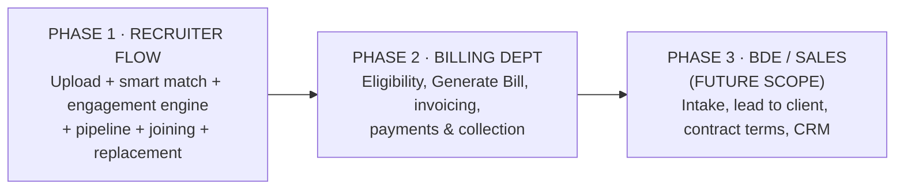

# Recruitment OS — Product Roadmap

**Audience:** Leadership / senior stakeholders
**Purpose:** explain *what* we are building, *why*, in *what order*, and *how it wins* against the market.
**Companion docs:** `RECRUITER_FLOW.md` (screens) · `TECHNICAL_IMPLEMENTATION_PLAN.md` (engineering) · `../DATA_FORMAT_AND_SPREADSHEET_UI_DESIGN.md` (data-format design).

---

## 1 · Executive summary

Recruitment OS is an **AI-first operating system for a recruitment agency** — one simple portal that takes a role from *"we need people"* all the way to a *paid invoice*, with AI doing the repetitive work in between.

We are building it **recruiter-first**. Recruiters are where placements — and therefore revenue — actually happen, and they are the users most buried in manual work today (living in personal Excel sheets, calling candidates one by one, re-typing the same data at every stage). We ship them a working end-to-end flow first, then the **Billing** department, and treat the **Business Development (BDE / Sales)** module as **future scope**.

**The outcome we are selling internally:** a recruiter who is productive on day one, an agency with a single clean source of truth instead of dozens of private spreadsheets, and revenue that is captured automatically because billing is tied to the joining date and the contract — not to someone's memory.

---

## 2 · The problem we are solving

| Today's reality | Cost to the business |
|---|---|
| Every recruiter and Team Lead keeps their **own Excel format** | No shared truth; reporting and billing are rebuilt by hand |
| Candidates are **called and messaged manually**, one at a time | Recruiters spend hours on screening instead of judgement |
| Data is **re-typed at every stage** (lead → candidate → interview → invoice) | Errors, delays, and revenue leakage |
| Billing depends on someone **remembering** the joining date and terms | Missed invoices, disputes, unbilled placements |
| Replacement windows are tracked **in people's heads** | Fees written off; surprises when candidates leave early |

**In one line:** the agency is full of talented recruiters doing low-value data entry, on data that never becomes one trustworthy system.

---

## 3 · The solution — the recruiter journey on one page

A recruiter learns just **three verbs — Upload → Match → Launch** — and the AI does the busywork in between. Eight connected steps, data moving left to right, **never typed twice**:

1. **Upload data** — bring any Excel / CSV / JSON; AI maps and cleans it
2. **Smart Match** — the system ranks the best candidates for a role, *with reasons*
3. **Create campaign** — bundle the shortlist + script + channel in one button
4. **Engagement engine** — voice + WhatsApp screening that runs the candidate lifecycle on its own
5. **Pipeline & interviews** — stages move automatically; slots and client feedback are handled
6. **Offer & joining** — documents chased, back-out risk flagged, joining confirmed
7. **Replacement** — guarantee-period timers run in the background; replacement jobs auto-created
8. **Billing** *(next focus)* — eligibility computed, invoice pre-filled for Finance

Full annotated screens for every step are in **`RECRUITER_FLOW.md`**.

---

## 4 · Scope & priority — and what is deliberately deferred

| Area | Priority | Rationale |
|---|---|---|
| **Recruiter flow** | **Phase 1 — now** | Closest to revenue; biggest manual-work reduction; proves the whole data chain |
| **Billing department** | **Phase 2 — next focus** | Converts placements into cash; depends on clean Phase-1 data |
| **BDE / Sales** | **Phase 3 — future scope** | Valuable but not blocking; a role can enter Phase 1 by **upload** or a quick manual add |

> **Why this order matters for the pitch:** we prove the full "role → placed candidate → invoice" chain with a small, high-value slice first, using humans for the parts AI will later take over. We are not boiling the ocean.

---

## 5 · How we win — competitive positioning

The market is moving to **AI-native ATS/CRM**. The two most relevant modern products are **Spott** and **Recruiterflow**; the incumbents are **Bullhorn**, **Recruit CRM** and **Zoho Recruit**. Here is an honest read of where we match them and where we are different.

### What the leaders do well (and we should match)

- **Spott** positions itself as an *AI-native ATS & CRM for agencies*: contextual matching that ranks your whole database with the **evidence behind each score**, a built-in **note-taker**, **enrichment** (auto-fill missing email/phone/LinkedIn and keep profiles fresh), a **unified inbox** threading email/WhatsApp/VoIP/calendar to one record, plus CV reformatting, scheduling and analytics — **all included, no add-on credits**. [Source: [spott.io/why-spott](https://spott.io/why-spott), [spott.io/product/ats-crm-core](https://spott.io/product/ats-crm-core)]
- **Recruiterflow** centres on **AIRA**, a set of AI agents across the lifecycle — **Source, Matchmaker, Notetaker, Submission, Research/enrichment** — including background agents that **auto-update the CRM** without manual entry; **AIRA Source** taps 850M+ profiles enriched in a click; **multi-channel Sequences** (email/LinkedIn/phone/SMS with branching logic and reporting); a **Chrome extension** for one-click LinkedIn sourcing; a **client portal** with thumbs-up/down that moves candidate stages; and **job-change alerts** that keep the database fresh. [Source: [recruiterflow.com/ai](https://recruiterflow.com/ai), [AIRA agents guide](https://recruiterflow.com/blog/ai-agents-in-recruiterflow-a-complete-guide-to-every-aira-agent/), [AIRA Source](https://recruiterflow.com/aira-source)]

*Content above was rephrased for compliance with licensing restrictions.*

### Positioning matrix

| Capability | Spott | Recruiterflow | Bullhorn / Recruit CRM / Zoho | **Recruitment OS (us)** |
|---|:---:|:---:|:---:|:---:|
| AI contextual matching **with reasons** | ✔ | ✔ | partial | ✔ (Smart Match, explainable) |
| **Voice-AI phone screening at scale** (Hinglish) | — | — | — | ✔ **our edge** |
| WhatsApp-first candidate engagement | partial | partial | partial | ✔ **our edge** |
| **Bring-your-own-Excel** universal import + flexible per-desk schema | limited | limited | limited | ✔ **our edge** |
| Auto note-taker on calls/meetings | ✔ | ✔ | partial | Adopt (Phase 1–2) |
| Contact enrichment (email/phone/LinkedIn) | ✔ | ✔ | partial | Adopt (adapter) |
| Multi-channel sequences with branching | partial | ✔ | partial | ✔ (engagement engine) |
| Unified per-candidate inbox (all channels) | ✔ | ✔ | partial | Adopt (Phase 2) |
| Client portal / magic-link feedback | ✔ | ✔ | ✔ | ✔ (magic link) |
| Job-change / freshness alerts | — | ✔ | partial | Adopt (Phase 3) |
| **India-first billing** (GST/TDS) + replacement-window automation | — | — | partial | ✔ **our edge** |
| Built for **non-technical** recruiters (3-verb UX) | good | good | mixed | ✔ **our edge** |

### Our differentiators, stated plainly

1. **Voice AI + WhatsApp engagement engine for volume hiring.** Neither leader emphasises AI *phone* screening in Hindi/Hinglish. For warehouse, driver, retail and other high-volume Indian roles, this is a step change — the AI screens hundreds of candidates and hands the recruiter a hot list.
2. **We meet recruiters where they already are — in Excel.** Universal multi-format upload with a Team-Lead-governed flexible schema removes the single biggest switching cost. Competitors expect you to adopt *their* object model; we ingest *yours*.
3. **India-first commercials.** GST/TDS-aware invoicing, replacement-window guarantees, and WhatsApp-native outreach are first-class, not bolt-ons.
4. **Zero re-entry, revenue-safe.** Billing is computed from the joining date and versioned contract terms, so nothing is billed from memory and nothing leaks.

### Features we will consciously borrow (fast-follow the best)

| Adopt | From | Where it lands |
|---|---|---|
| Auto **note-taker** on recruiter calls/meetings → structured notes + actions | Spott, Recruiterflow (AIRA Notetaker) | Phase 1–2 |
| **Enrichment** adapter (find/refresh email, phone, LinkedIn) | Both | Phase 1 (adapter), on by Phase 2 |
| **Unified conversation inbox** per candidate (WhatsApp + call + email threaded) | Spott | Phase 2 |
| **CV reformatter / one-click candidate report** to send to client | Both | Phase 1–2 |
| **Job-change / freshness alerts** to keep the database warm | Recruiterflow | Phase 3 |
| **Chrome-extension sourcing** from LinkedIn/web | Recruiterflow | Phase 3 |
| **Automation "recipes" + internal SLA alerts** (configurable rules) | Recruiterflow | Phase 2 |
| **"All included" packaging** (no per-feature credits) | Spott | Commercial/pricing decision |

---

## 6 · Phased delivery & the value each phase proves

| Phase | Ships | Business value proven | Relative size |
|---|---|---|---|
| **1 · Recruiter flow** | Upload/mapping/dedup · Smart Match · Campaign · Engagement engine · Pipeline · Interviews · Offer/Joining · Replacement timers · Today/Reports | Recruiters off spreadsheets and off manual calling; one clean database; huge time saved | **L** |
| **2 · Billing dept** | Eligibility rules · Generate Bill · GST/TDS invoicing · payments & collection · unified inbox · note-taker · enrichment on | Placements convert to cash automatically; revenue leakage closed | **L** |
| **3 · BDE / Sales (future)** | Intake · lead→client · versioned contract terms · sales CRM board · job-change alerts · chrome sourcing | Full front-to-back agency OS; new-business engine | **M** |

*Sizes are relative effort, not calendar commitments.*

---

## 7 · Success metrics (how we'll know it works)

| Theme | Target range* | Why it matters |
|---|---|---|
| Manual-work reduction | 60–80% | The core promise to recruiters |
| Time-to-fill | 7–15 days | Faster placements, happier clients |
| Recruiter productivity | 2–3× | More placements per head |
| Placement / offer-to-join | 70–90% / 30–50% | Pipeline quality |
| Billable-candidate capture | 90%+ | Revenue not left on the table |
| Invoice cycle time | 1–2 days | Cash in faster |

*Illustrative ranges from the white paper; actuals depend on the agency's starting point.*

---

## 8 · Risks & how the design handles them

| Risk | Mitigation |
|---|---|
| AI mis-reads a message or answer | Confidence chips, original source always shown, nothing commits without one-tap human confirmation |
| Recruiters find it complicated | Seven menu items, one *Today* screen, three-verb workflow, pre-filled forms |
| WhatsApp / calling rules change | Provider-agnostic integration layer; consent + opt-out logged; template approval |
| Wrong invoice sent | Pre-flight checks, Finance approval, versioned contract terms, full audit trail |
| Messy or duplicate data on import | Guided import with validation, de-duplication and a review queue; 30-day undo |
| Vendor lock-in | Swappable telephony, LLM, WhatsApp and accounting connectors (adapter pattern) |

---

## 9 · Decisions & dependencies we need from leadership

- **Fee models** to support on day one (percentage of CTC, fixed, slab?)
- **Tax & currency** rules for the first release (GST, TDS handling)
- **WhatsApp Business provider** and **telephony/voice** vendor; **voice languages** (Hindi, English, Hinglish)
- **Accounting system** to sync invoices with (Tally, Zoho Books, other)
- **Enrichment / profile-data provider** (build vs buy) for contact enrichment
- **Existing data to migrate** (candidates, open roles) and its formats
- **Users per role** in the first 6 months (sizing)
- **Legal sign-off** on WhatsApp/telephony consent and **India DPDP** data handling

---

## 10 · Vision horizons

- **Now:** recruiter flow — off spreadsheets, off manual calling, one clean database
- **Next (Phase 2):** billing & collection closed-loop; enrichment, note-taker and unified inbox make the record self-maintaining
- **Then (Phase 3):** BDE/Sales front end; predictive insight (which roles will fill, which placements are at risk)
- **Long term:** an industry-leading, AI-native agency OS — the system a new recruiter is productive on within a day

---

*Competitor facts are drawn from the vendors' own public pages, linked inline, and were rephrased for compliance with licensing restrictions. They describe the market as of the research date and should be re-verified before external use.*
