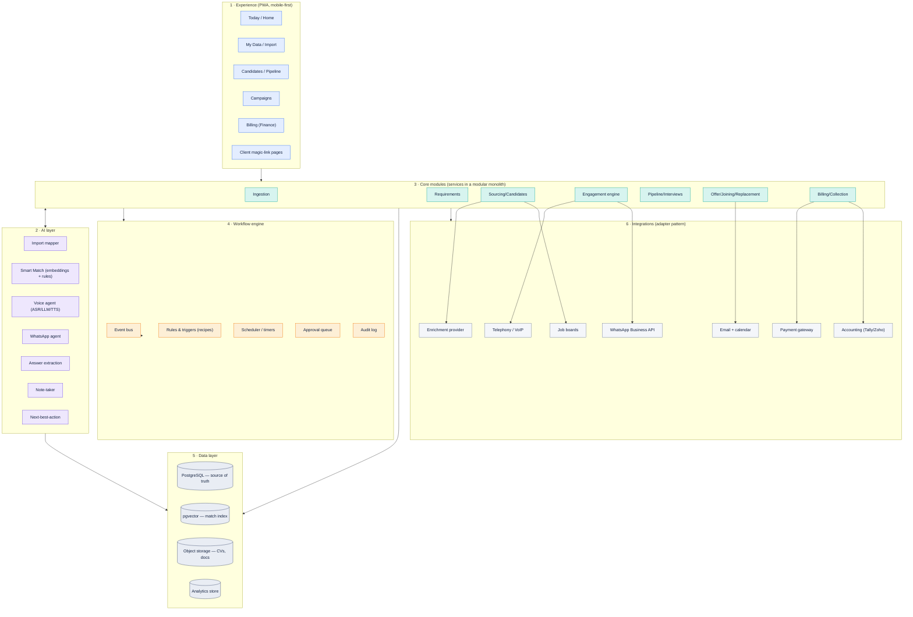
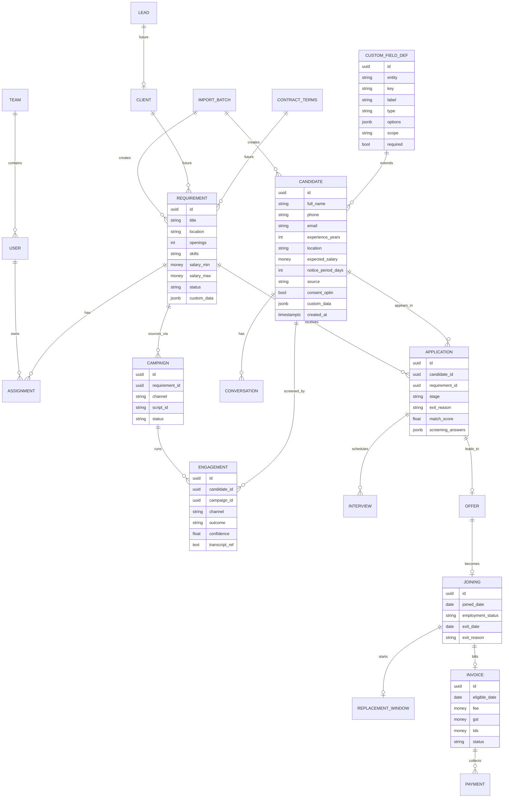
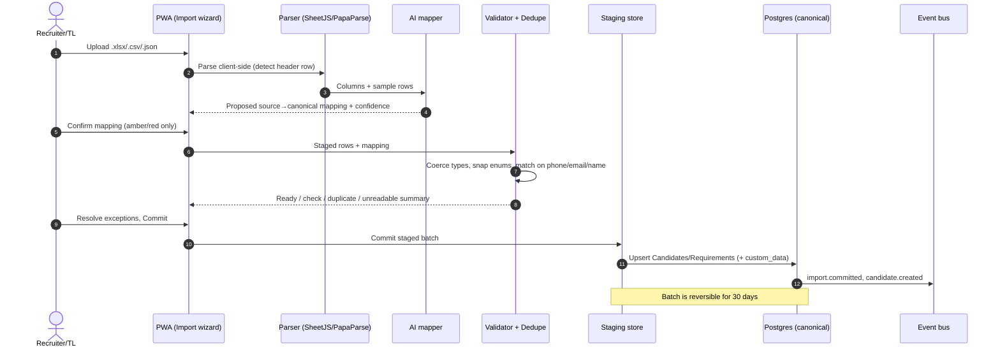
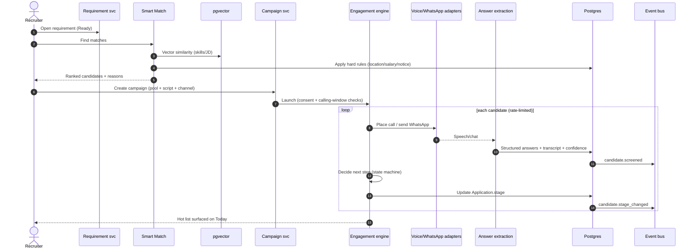
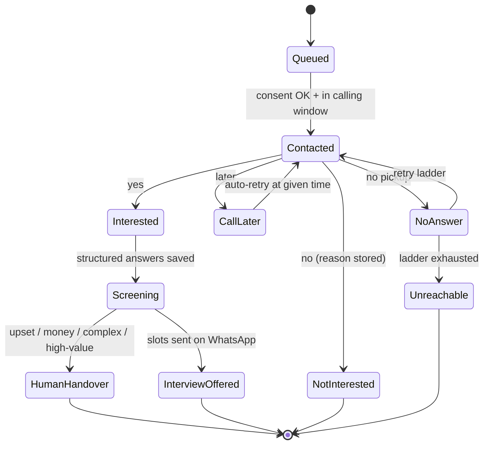

# Recruitment OS — Technical Implementation Plan

**Audience:** Engineering (architects, backend, frontend, data, DevOps)
**Purpose:** the reference for **architecture, screens, user flow, and data flow** to build the recruiter-first Recruitment OS.
**Companion docs:** `ROADMAP.md` (why/scope) · `RECRUITER_FLOW.md` (annotated screens) · `../DATA_FORMAT_AND_SPREADSHEET_UI_DESIGN.md` (data-format rationale).

**Scope reminder:** Phase 1 = **Recruiter flow**; Phase 2 = **Billing**; Phase 3 = **BDE / Sales (future scope)**. BDE entities appear in the model as *future* (dashed) so we design forward-compatibly without building them now.

---

## 1 · Architecture overview

Modular, **event-driven**, with AI as a first-class layer in the middle. Every technology is **swappable** behind an interface.



**Principles**

- **Modular monolith first.** One deployable with clear internal module boundaries and an internal event bus. Split a module into its own service only when scale demands it.
- **Event-sourced timeline.** Every state change emits an event (`candidate.stage_changed`, `joining.confirmed`, `billing.eligible`…). Events power the history tab, audit trail, analytics, and every automation trigger.
- **AI drafts, humans confirm.** AI output carries a confidence score; anything touching money, terms, or rejections goes through the **approval queue**.
- **Adapters everywhere external.** Telephony, WhatsApp BSP, LLM, enrichment, accounting all sit behind interfaces so vendors are swappable.

---

## 2 · Technology stack (suggested, swappable)

| Layer | Choice | Why |
|---|---|---|
| Frontend | **React / Next.js** (TypeScript) + React Query | | One codebase for desktop + phone; installable; offline-tolerant|
| Grid / spreadsheet UI | **AG Grid** (lists/pipeline) + **Univer** (true spreadsheet views) | Excel-like feel  |
| Backend | **Python (FastAPI)** with an internal event bus | Simple to run/change; typed; strong async support |
| Database | **PostgreSQL 16 + pgvector** | One store for records, timeline, events, and match vectors; JSONB for custom fields |
| Cache / queue | **Redis** (+ BullMQ / RQ) | Timers, retries, campaign fan-out, nightly billing checks |
| Object storage | **S3-compatible** | CVs, contracts, invoices, call recordings |
| Search/match | pgvector (start) → dedicated vector DB only if needed | Contextual matching with explainability |
| File parsing | **SheetJS** (xlsx), **Papa Parse** (csv), native JSON | Client-side staged parsing |
| AI/LLM | Claude, GPT **LLM gateway**; ASR + TTS Hunar.ai | Extraction, drafting, matching rationale, voice |
| Realtime | WebSocket / SSE | Live campaign progress, pipeline updates |
| Auth |  JWT, RBAC | Role-scoped access |
| Observability | OpenTelemetry + logs/metrics/traces | SLAs, campaign health, anomaly alerts |

---

## 3 · Canonical data model

**Design rule (the universal-yet-flexible model):** stable **system fields** live in typed Postgres columns; desk-specific **custom fields** live in an indexed `JSONB` column governed by a Team-Lead-owned registry. This gives Airtable-like flexibility with SQL integrity. (Full rationale: `../DATA_FORMAT_AND_SPREADSHEET_UI_DESIGN.md`.)



**Key modelling decisions**

- **Candidate ≠ Application.** One person can be in many jobs; stage, score, exit reason and screening answers live on **Application**, so nothing is overwritten.
- **Money hangs off Joining.** Invoice eligibility is derived from `joined_date` + contract trigger; no joining, no billing.
- **Custom fields** are typed definitions in `CUSTOM_FIELD_DEF` (scope: org/team/desk) with values in each entity's `custom_data` JSONB; hot fields get GIN or generated-column indexes.
- **Future-scope BDE** (`LEAD`, `CLIENT`, `CONTRACT_TERMS`) is modelled but not built in Phase 1; `REQUIREMENT` can exist standalone (created by import or manual add).

---

## 4 · User flow mapped to screens

Every screen below is a rendered mockup in `assets/img/` (see `RECRUITER_FLOW.md` for annotations).

| # | Screen | Route | Key components | Primary APIs | Emits events |
|---|---|---|---|---|---|
| 1 | Home / Today | `/today` | ActionList, QuickStart, Counters | `GET /today`, `GET /metrics/summary` | — |
| 2 | Data upload | `/my-data/import` | Dropzone, FormatChips, FileList | `POST /imports` | `import.created` |
| 3 | Column mapping | `/my-data/import/map` | MapTable, ConfidenceChip, CustomFieldAdder | `POST /imports/{id}/mapping`, `GET /field-registry` | `import.mapped` |
| 4 | Review & fix | `/my-data/import/review` | ValidationTable, DedupeResolver | `GET /imports/{id}/staged`, `POST /imports/{id}/commit` | `import.committed`, `candidate.created` |
| 5 | TL data & format | `/my-data/format` | FieldRegistry, TemplateBuilder, TeamUploads | `GET/POST /field-registry`, `GET /imports?team` | `field.defined` |
| 6 | Requirement | `/requirements/{id}` | FieldGrid, CompletenessMeter, ScreeningQs | `GET/PATCH /requirements/{id}` | `requirement.ready` |
| 7 | Smart Match | `/requirements/{id}/smart-match` | MatchList, ScoreBar, ReasonTags | `POST /requirements/{id}/match` | `match.run` |
| 8 | Create campaign | `/campaigns/new` | PoolPicker, ChannelToggle, ConsentCheck | `POST /campaigns` | `campaign.created` |
| 9 | Engagement engine | `/campaigns/{id}/live` | ProgressBar, OutcomeCounters, HotList | `GET /campaigns/{id}/live` (SSE) | `candidate.screened`, `candidate.stage_changed` |
| 10 | Pipeline board | `/requirements/{id}/pipeline` | KanbanColumns, CandidatePanel | `GET /pipeline`, `POST /applications/{id}/move` | `candidate.stage_changed` |
| 11 | Interviews & feedback | `/interviews` + magic link | Scheduler, ReminderLadder, MagicLinkPage | `POST /interviews`, `POST /feedback/{token}` | `interview.scheduled`, `client.feedback` |
| 12 | Offer & joining | `/candidates/{id}/offer` | DocChecklist, RiskCard, JoiningLadder | `POST /offers`, `POST /joinings` | `offer.made`, `joining.confirmed` |
| 13 | Replacement | `/reports/replacement` | Timeline, ExposureTable | `GET /replacements` | `employment.left`, `replacement.created` |
| 14 | Billing handoff | `/billing` | EligibleList, InvoicePreview, PreflightChecks | `GET /billing/eligible`, `POST /invoices` | `billing.eligible`, `invoice.sent` |

---

## 5 · Data flow (end to end)

### 5.1 Multi-format import → clean canonical records



### 5.2 Smart Match → Campaign → Engagement engine → Pipeline



### 5.3 Joining → Replacement → Billing (revenue-safe chain)

```mermaid
sequenceDiagram
    autonumber
    participant OFF as Offer/Joining svc
    participant SCHED as Scheduler/timers
    participant REPL as Replacement svc
    participant BILL as Billing svc
    participant APPR as Approval queue
    actor F as Finance
    participant ACC as Accounting adapter
    participant BUS as Event bus

    OFF->>BUS: joining.confirmed (joined_date)
    OFF->>SCHED: Start replacement window + billing-eligibility timer
    SCHED->>REPL: Check-ins day 7/30/60/90
    alt candidate leaves inside window
        REPL->>BUS: employment.left
        REPL->>REPL: Clone linked replacement requirement (no new fee)
        REPL->>BILL: Hold invoice / suggest credit note
    else window passes, still employed
        SCHED->>BILL: Mark billing.eligible
        BILL->>BILL: Pre-fill invoice (fee, GST, TDS) + pre-flight checks
        BILL->>APPR: Await Finance approval
        F->>APPR: Approve & Generate Bill
        BILL->>ACC: Sync invoice
        BILL->>BUS: invoice.sent
    end
```

---

## 6 · Subsystem specifications

### 6.1 Ingestion (multi-format upload)

| Concern | Approach |
|---|---|
| Formats | `.xlsx/.xls` (SheetJS), `.csv/.tsv` (Papa Parse streaming), `.json` (native, incl. nested), Google Sheet link (Sheets API read) |
| Parse location | Client-side into a **staged batch**; live DB untouched until commit |
| Mapping | Heuristic + embedding matcher proposes `source header → canonical field`; confidence gates auto-accept (≥85%), confirm (60–85%), never-guess (<60%) |
| Mapping memory | Confirmed mappings saved as a **template** keyed to `user_id + file_signature` → one-click re-imports |
| Custom fields | Non-standard headers become typed entries in `CUSTOM_FIELD_DEF` (text/number/date/list/money/bool); values in `custom_data` JSONB |
| Validation | Per-field coercion (date, currency, phone), enum snapping, required checks; failures quarantined |
| De-duplication | Entity resolution priority phone → email → name+context; re-import updates instead of duplicating |
| Reversibility | Every batch = staged, undoable transaction for 30 days |

### 6.2 Smart Match

- **Signals:** vector similarity between requirement JD/skills embedding and candidate profile embedding **+** hard rules (location radius, salary band, notice period, availability).
- **Score = weighted blend**, normalised 0–100; **explainability** returns the top contributing facts ("3 yrs WMS, Gurgaon, 15-day notice, salary in range").
- **Sources in order:** own database first → then portals/referrals/enrichment (cost-aware).
- **Dedup** so each person appears once; recruiter corrections feed back as training signal.

### 6.3 Candidate Engagement Engine

The automation core. A **campaign orchestrator** drives per-candidate conversations across channel adapters, extracts structured answers, and advances each Application through a lifecycle state machine — with guardrails.



- **Channels:** Voice agent (ASR → LLM → TTS) and WhatsApp agent, behind adapters; "Both, WhatsApp-first" supported.
- **Extraction:** speech/chat → structured fields (`interested`, `experience`, `expected_salary`, `notice`, `availability`) with confidence; low-confidence answers are flagged, never guessed.
- **Guardrails (non-negotiable):** consent captured/logged; do-not-disturb & calling hours; approved templates only; opt-out honoured; human handover on upset/money/complex/high-value; fair-questions-only; DPDP retention.
- **Control:** hot candidates surfaced; one-tap "take over" any conversation; every script pre-approved.
- **Scale:** rate-limited fan-out via the queue; live progress via SSE.

### 6.4 Workflow engine

- **Event bus** — publish/subscribe backbone; every module both emits and reacts.
- **Rules & triggers ("recipes")** — configurable automations (borrowed from Recruiterflow), e.g. *"no interview in 4 days → nudge recruiter"*.
- **Scheduler / timers** — replacement windows, reminder ladders, nightly billing-eligibility sweep.
- **Approval queue** — human gate for money/terms/rejections.
- **Audit log** — who/what/when/before→after on every change; powers history + compliance.

---

## 7 · Event catalogue (core triggers)

| Event | Emitted by | Typical consumers |
|---|---|---|
| `import.committed` | Ingestion | Candidate/Requirement svc, analytics |
| `candidate.created` | Ingestion/Sourcing | Smart Match index, dedupe |
| `requirement.ready` | Requirements | Assignment, Smart Match |
| `match.run` | Smart Match | Campaign suggestion, analytics |
| `campaign.created` | Campaign | Engagement engine |
| `candidate.screened` | Engagement engine | Pipeline, Today, analytics |
| `candidate.stage_changed` | Pipeline/Engine | Funnel/ageing recompute, notifications |
| `interview.scheduled` | Interviews | Reminder ladder, calendar |
| `client.feedback` | Magic-link | Pipeline move, recruiter alert |
| `offer.made` | Offer | Fee preview, doc chasers |
| `joining.confirmed` | Joining | Replacement + billing timers |
| `employment.left` | Replacement | Replacement clone, invoice hold |
| `billing.eligible` | Scheduler/Billing | Finance notification, invoice prefill |
| `invoice.sent` | Billing | Accounting sync, collection reminders |

---

## 8 · API surface (representative)

```
# Ingestion
POST   /imports                      # create batch (file metadata)
POST   /imports/{id}/mapping         # save/confirm column mapping
GET    /imports/{id}/staged          # staged rows + validation summary
POST   /imports/{id}/commit          # commit to canonical (reversible)
GET    /field-registry               # custom + system field defs
POST   /field-registry               # TL adds custom field

# Requirements & matching
GET    /requirements/{id}
PATCH  /requirements/{id}
POST   /requirements/{id}/match      # run Smart Match -> ranked + reasons

# Campaigns & engagement
POST   /campaigns                    # pool + script + channel
GET    /campaigns/{id}/live          # SSE stream of progress/outcomes
POST   /engagements/{id}/takeover    # recruiter joins conversation

# Pipeline & interviews
GET    /requirements/{id}/pipeline
POST   /applications/{id}/move       # stage change (+ exit reason)
POST   /interviews                   # create + reminders
POST   /feedback/{token}             # client magic-link decision (no auth)

# Offer / joining / replacement
POST   /offers
POST   /joinings                     # confirm -> starts clocks
GET    /replacements                 # exposure table

# Billing (Phase 2)
GET    /billing/eligible
POST   /invoices                     # generate (pre-flight + approval)
POST   /invoices/{id}/payments
```

All mutating endpoints write an **audit event** and respect **RBAC** (ownership-scoped).

---

## 9 · Integrations (adapter pattern)

| Adapter | Used by | Notes |
|---|---|---|
| Telephony / VoIP | Engagement engine (voice) | Call placement, recording, DTMF; provider-agnostic |
| WhatsApp Business API (BSP) | Engagement, reminders, magic links | Template approval, opt-in/opt-out, session windows |
| Email + calendar | Interviews, offers | Invites, reminders, scheduling |
| Enrichment provider | Sourcing | Fill/refresh email, phone, LinkedIn (**adopt** from Spott/Recruiterflow) |
| Job boards | Sourcing | Post roles, ingest replies |
| E-sign | Offer | Optional |
| Payment gateway | Billing | Payment links |
| Accounting (Tally / Zoho Books) | Billing | Invoice sync, reconciliation |

---

## 10 · Adopted competitor features — engineering notes

Informed by **Spott** and **Recruiterflow** (see `ROADMAP.md §5` for sourced comparison). Each slots into existing layers:

| Feature | Where it lives | Build note |
|---|---|---|
| **Note-taker** on recruiter calls/meetings | AI layer + Conversation entity | ASR → LLM summary → structured actions synced to record |
| **Enrichment** (email/phone/LinkedIn, freshness) | Enrichment adapter + Sourcing | On-add enrich; scheduled re-verify job |
| **Unified conversation inbox** per candidate | Conversation entity + Experience | Thread WhatsApp/call/email to one record view |
| **CV reformatter / candidate report** | AI layer + Pipeline "Send to client" | Template-based; anonymised option |
| **Multi-channel sequences w/ branching** | Engagement engine (already state-machine based) | Extend channels: email/SMS/LinkedIn steps |
| **Automation "recipes" + SLA alerts** | Workflow engine (rules) | Rule builder UI + internal SLA timers |
| **Job-change / freshness alerts** | Scheduler + Enrichment | Phase 3; watch profile deltas |
| **Chrome-extension sourcing** | New client + Sourcing API | Phase 3; one-click add from web |

---

## 11 · Security, compliance & NFRs

- **RBAC & visibility:** ownership-scoped (recruiter sees own; manager sees team; owner sees all); money fields restricted to Finance/AM/Owner.
- **Consent & audit:** candidate consent captured with timestamp; every edit logged (who/what/when/before→after); nothing silently overwritten by AI.
- **Privacy:** **India DPDP** readiness — retention limits, delete-on-request, purpose limitation; WhatsApp/telephony rules confirmed with legal.
- **Encryption:** TLS in transit; encryption at rest for PII, recordings, documents.
- **Performance targets:** import parse feedback < a few seconds for typical files; pipeline/board interactions snappy on mobile; campaign fan-out rate-limited to respect provider + DND rules.
- **Reliability:** staged imports reversible 30 days; idempotent event handlers; retries with backoff on channel adapters.
- **Observability:** per-campaign health (answer rate, opt-out rate, handover rate), anomaly alerts, tracing across the event bus.

---

## 12 · Phase → module build plan

| Phase | Modules to build | Depends on |
|---|---|---|
| **1 · Recruiter flow** | Auth/RBAC, Data model + custom-field registry, Ingestion, Requirements, Smart Match, Campaign, Engagement engine (voice+WhatsApp), Pipeline/Interviews, Offer/Joining/Replacement timers, Today/Reports, Event bus + scheduler + audit | — |
| **2 · Billing dept** | Billing/eligibility rules, Invoice + GST/TDS, Payments/collection, Accounting adapter, Unified inbox, Note-taker, Enrichment (on) | Phase-1 data chain, joining events |
| **3 · BDE / Sales (future)** | Intake (message→draft), Lead→Client CRM, versioned Contract terms, sales board, job-change alerts, Chrome-extension sourcing | Contract terms feed Requirements/fees |

**Suggested module layout (modular monolith)**

```
/apps/web            # Next.js PWA
/services
  /ingestion         # parse, map, validate, dedupe, commit
  /candidates        # candidate + custom fields + enrichment
  /requirements      # roles, completeness, screening qs
  /matching          # smart match (pgvector + rules)
  /engagement        # campaign orchestrator, channel adapters, extraction
  /pipeline          # applications, stages, interviews, feedback
  /placements        # offer, joining, replacement timers
  /billing           # eligibility, invoices, payments (Phase 2)
  /workflow          # event bus, rules/recipes, scheduler, approvals, audit
  /integrations      # telephony, whatsapp, email/cal, enrichment, accounting adapters
/packages
  /domain            # shared entities, events, types
  /ai                # llm gateway, extraction, matching, note-taker
```

---

## 13 · Screens appendix

| Screen | Image | Route | Purpose |
|---|---|---|---|
| Overview | `assets/img/00-overview.png` | — | The whole recruiter journey |
| Home / Today | `assets/img/01-home.png` | `/today` | Merged next actions + 3-verb start |
| Data upload | `assets/img/02-import-upload.png` | `/my-data/import` | Multi-format upload |
| Column mapping | `assets/img/03-import-mapping.png` | `/my-data/import/map` | AI header → field mapping |
| Review & fix | `assets/img/04-import-review.png` | `/my-data/import/review` | Validate + dedupe + commit |
| TL data & format | `assets/img/05-tl-templates.png` | `/my-data/format` | Locked + custom fields, templates |
| Requirement | `assets/img/06-requirement.png` | `/requirements/{id}` | The role to fill |
| Smart Match | `assets/img/07-smart-match.png` | `/requirements/{id}/smart-match` | Ranked candidates + reasons |
| Create campaign | `assets/img/08-campaign-new.png` | `/campaigns/new` | Pool + script + channel |
| Engagement engine | `assets/img/09-engagement-engine.png` | `/campaigns/{id}/live` | Auto screening + lifecycle |
| Pipeline board | `assets/img/10-pipeline.png` | `/requirements/{id}/pipeline` | Auto-moved stages |
| Interviews & feedback | `assets/img/11-interview.png` | `/interviews` | Slots + client magic link |
| Offer & joining | `assets/img/12-offer-joining.png` | `/candidates/{id}/offer` | Docs, risk, joining |
| Replacement | `assets/img/13-replacement.png` | `/reports/replacement` | Timers + exposure |
| Billing handoff | `assets/img/14-billing.png` | `/billing` | Eligibility + invoice (Finance) |

> Editable screen source is in `assets/src/` (`*.html`, `ui.css`); re-render with `assets/src/r.sh <name> <width> <height>`.
